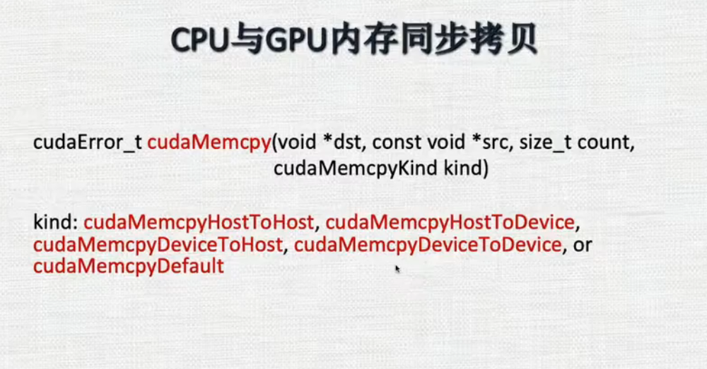

#### C
1. malloc
2. calloc
3. free

#### C++
1. new
2. delete

#### GPU

1. 寄存器
2. 本地内存
3. 共享内存 share

4. 常量内存
5. 文理内存
6. 全局内存
7. 缓存(L1 L2)

#### GPU内存分配
1. 内存申请
cudaError_t cudaMallocHost()
cudaMalloc
2. 内存释放
cudaError_t cudaFreeHost()
cudaMemcpy
3. 统一内存

4. CPU和GPU内存同步拷贝

5. CPU和GPU内存异步拷贝

6. 

