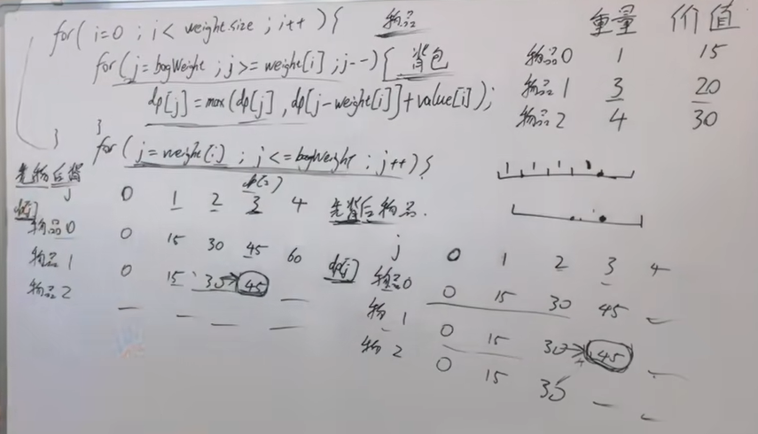

### 01背包的遍历顺序
```go
// 01背包的遍历顺序
for 物品
   for 背包 (要倒序遍历) j:=bagweight; j>=weight[i];j--{
	   
}

```

### 完全背包的遍历顺序
1. 先遍历 物品(纯背包问题可以先遍历物品也可以遍历背包)
```go
for 物品
    for 背包 (正序遍历) j:=weight[i]; j<=bagweight];j++{
    
    }
```

2. 先遍历背包再遍历物品(纯背包问题可以先遍历物品也可以遍历背包)

