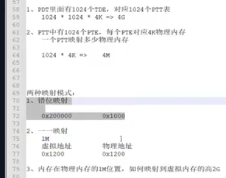

两种映射:
1. 错位映射
2. 一一映射




在Linux内存管理中，**PDT**（Page Directory Table）和 **PTT**（Page Table Table）并不是标准术语。根据上下文推测，您可能是指 **页表结构** 中的某些层级，例如 **页目录（Page Directory）** 和 **页表（Page Table）**。以下是相关概念的详细解释：

---

### **1. 页表结构（x86架构）**
Linux的内存管理基于**分页机制**，将虚拟地址转换为物理地址。x86架构的分页机制分为多级页表（如32位的2级、64位的4级），每级页表由特定的数据结构组成：

#### **(1) 32位系统（2级页表）**
- **页目录（Page Directory, PGD）**：
    - 每个页目录项（PDE, Page Directory Entry）指向一个页表（Page Table）。
    - 页目录的大小为 1024 个 PDE（每个占 4 字节），总大小为 4KB。
    - 虚拟地址的高 10 位（22:31）用于索引页目录。

- **页表（Page Table, PTE）**：
    - 每个页表项（PTE, Page Table Entry）指向一个物理页帧（4KB）。
    - 页表的大小为 1024 个 PTE（每个占 4 字节），总大小为 4KB。
    - 虚拟地址的中间 10 位（12:21）用于索引页表，低 12 位（0:11）表示页内偏移。

#### **(2) 64位系统（4级页表）**
Linux在x86_64架构中使用**四级页表**，层级如下：
1. **PGD**（Page Global Directory）：顶级页表。
2. **PUD**（Page Upper Directory）：第二级页表。
3. **PMD**（Page Middle Directory）：第三级页表。
4. **PTE**（Page Table Entry）：第四级页表，最终指向物理页帧。

每级页表通过虚拟地址的高位逐步索引，最终映射到物理地址。

---

### **2. 可能的混淆点**
#### **(1) PDT 与 PGD**
- **PDT**（Page Directory Table）可能是对 **PGD**（Page Global Directory）的误解或旧术语。在32位系统中，PGD对应的是 **页目录**（Page Directory）。
- 在64位系统中，PGD是四级页表的顶层，负责索引PUD。

#### **(2) PTT 与 PTE**
- **PTT**（Page Table Table）可能是对 **PTE**（Page Table Entry）的误解。PTE是页表项，直接指向物理页帧。
- 在32位系统中，页表（Page Table）由PTE组成；在64位系统中，页表的每一级都由类似结构（如PTE）组成。

---

### **3. 页表的作用**
页表的核心功能是**虚拟地址到物理地址的映射**，其层级结构支持：
- **大地址空间**：通过多级页表减少内存开销（如64位系统支持48位虚拟地址，4级页表仅需16KB存储）。
- **按需分页**：仅在进程需要时加载页表项，节省内存。
- **内存保护**：通过页表项标志（如读写权限、用户/内核模式）控制访问权限。

---

### **4. Linux中的实现**
- **PGD/PUD/PMD/PTE**：
    - 每个进程的地址空间由独立的PGD管理（用户空间和内核空间共享内核PGD）。
    - 内核通过 `pgd_alloc()` 等函数分配和初始化页表。
    - 页表项的标志（如 `P`、`R/W`、`U/S`）定义在页表项结构中（如 `pte_t`）。

- **页表操作函数**：
    - `pgd_offset()`：获取当前进程PGD的偏移。
    - `pud_offset()`、`pmd_offset()`、`pte_offset()`：逐级遍历页表。
    - `set_pte()`：设置PTE项的值。

---

### **5. 示例代码（简化版）**
```c
// 获取PGD项
pgd_t *pgd = pgd_offset(current->mm, virtual_address);

// 获取PUD项
pud_t *pud = pud_offset(pgd, virtual_address);

// 获取PMD项
pmd_t *pmd = pmd_offset(pud, virtual_address);

// 获取PTE项
pte_t *pte = pte_offset_map(pmd, virtual_address);

// 设置PTE项（映射物理页帧）
set_pte(pte, pte_mkvalid(pte_mkdirty(pte_mkwrite(pte_mkuser(pte_mkpage(pte_val, page)))));
```

---

### **6. 总结**
- **PDT/PTT** 并非Linux内存管理的标准术语，可能是对 **PGD/PTE** 的误写。
- Linux的页表结构（PGD/PUD/PMD/PTE）是分页机制的核心，通过多级映射实现高效内存管理。
- 理解页表层级和操作函数有助于深入分析Linux内存分配、缺页异常处理等机制。

如果需要进一步探讨某个具体层级或函数的实现细节，请随时提问！