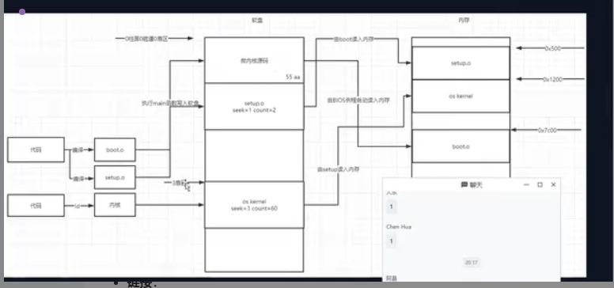

linux的文件系统实现流程是我写的类似这样子的吗: 应用程序--->操作系统内核--->文件系统--->硬盘驱动--->主机PCIE 芯片 --->(主通道 从通道)

您提供的流程概述了数据从应用程序到硬盘的大概路径，但为了更精确地理解Linux文件系统和存储设备之间的交互过程，我们可以细化这个流程。以下是更详细的描述：

1. **应用程序**：当应用程序需要读取或写入文件时，它会通过标准的系统调用接口（如`open`, `read`, `write`, `close`等）请求操作系统执行这些操作。

2. **操作系统内核**：一旦应用程序发出系统调用，控制权就传递给了操作系统内核。内核中的虚拟文件系统（VFS, Virtual File System）层提供了统一的接口来处理不同类型的文件系统。

3. **文件系统**：VFS将请求转发给具体的文件系统实现（例如ext4, NTFS, FAT等）。文件系统负责维护文件结构、目录、权限等，并将逻辑文件操作转换为具体的数据块位置。

4. **块设备层**：文件系统并不直接与硬件通信，而是通过块设备层进行。这一层管理I/O调度，决定数据块的最佳读写顺序以优化性能。

5. **设备驱动程序**：接下来，请求到达相应的设备驱动程序。对于硬盘来说，这可能是SATA、SCSI或者NVMe驱动等。驱动程序知道如何与特定类型的硬件通信，发送命令并传输数据。

6. **主机PCIE芯片**：如果是使用PCIe SSD，那么在驱动程序和实际存储介质之间还会有PCIe控制器参与，用于管理PCI Express总线上的通信。

7. **主通道/从通道**：这个表述可能指的是存储设备内部的架构细节，比如某些SSD内部使用的多通道控制器设计，但这通常不是操作系统或文件系统层面关心的内容。在操作系统看来，它是通过驱动程序与“块设备”交互的。

总结起来，您的描述基本正确，但是更准确地说，应该是：应用程序 -> 系统调用接口 -> VFS -> 文件系统 -> 块设备层 -> 设备驱动程序 -> 主机PCIE芯片（如果适用）-> 存储设备。至于存储设备内部的工作机制，如主通道和从通道的概念，则属于硬件设计范畴，超出了Linux文件系统的讨论范围。

这张图片展示了一个操作系统启动过程的示意图，特别是从硬盘加载到内存的过程。以下是详细的解释：

### 左侧部分：代码编译和链接

1. **代码**：
    - 两块代码分别被编译成 `boot.o` 和 `setup.o`。
    - 这些代码可能包含了引导程序和设置程序的源代码。

2. **链接**：
    - 编译后的对象文件 `boot.o` 和 `setup.o` 被链接成一个可执行文件或最终的引导镜像。
    - 链接过程中可能会生成 `os kernel` 文件，这可能是操作系统的内核代码。

### 中间部分：硬盘上的内容

1. **微内核源码**：
    - 硬盘上存储了微内核源码，这部分代码位于硬盘的特定扇区中。
    - 图中标注了 `55 aa`，这是典型的主引导记录（MBR）结束标志，表明这是一个有效的引导扇区。

2. **setup.o seek=1 count=2**：
    - 表示 `setup.o` 文件在硬盘上的位置是从第一个扇区开始，读取两个扇区的内容。
    - 这部分数据会被加载到内存中进行处理。

3. **os kernel seek=3 count=60**：
    - 表示 `os kernel` 文件在硬盘上的位置是从第三个扇区开始，读取六十个扇区的内容。
    - 这是操作系统内核的主要部分，将被加载到内存中以启动操作系统。

### 右侧部分：内存中的内容

1. **内存布局**：
    - 内存中展示了不同部分的地址和内容。
    - `boot.o` 被加载到 `0x7c00` 地址处，这是传统的MBR加载地址。
    - `setup.o` 被加载到 `0x9000` 地址处。
    - `os kernel` 被加载到 `0x10000` 地址处。

2. **加载过程**：
    - BIOS会自动将硬盘的第一个扇区（即MBR）加载到内存的 `0x7c00` 地址处。
    - 接着，引导程序会继续加载 `setup.o` 和 `os kernel` 到指定的内存地址。

### 其他细节

- **执行main函数**：
    - 在内存中加载完成后，控制权会转移到 `boot.o` 的 `main` 函数，开始执行引导过程。
    - `main` 函数会进一步调用 `setup.o` 中的代码来完成系统初始化。

- **聊天窗口**：
    - 图片右下角显示了一个聊天窗口，与启动流程无关，可能是截图时无意中包含进来的。

总结来说，这张图详细描述了从硬盘加载引导程序和操作系统内核到内存的过程，以及内存中各部分的布局和加载顺序。这个过程是操作系统启动的关键步骤之一。