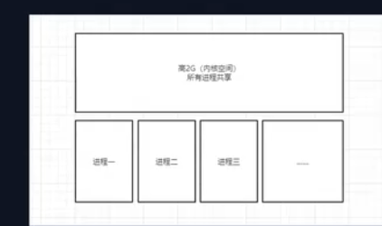

#### 程序 
1. QQ 
2. 有道
3. 微信

#### 进程 PCB process controller block

1. 进程是空间 

#### 线程  TCP thread controller block
1. 干活

#### 协程 
1. 用户态  
2. 抢占式(IO阻断 自动让) 非抢占式(时钟中断)

#### 纤程 
1. windows(API) 感觉像是例程 pthread_create

kthread_create 内核段 

------------------ 门 快速调用

pthread_create 用户段

#### 实现任务的步骤
1. 想好你想实现怎样的协程机制(抢占式or非抢占式)
2. 创建任务 可以实现调度
3. 实现时钟中断
4. 保存上下文，恢复上下文
5. 引入优先级
6. sleep

#### 进程切换
1. CR3

#### 内存结构

    