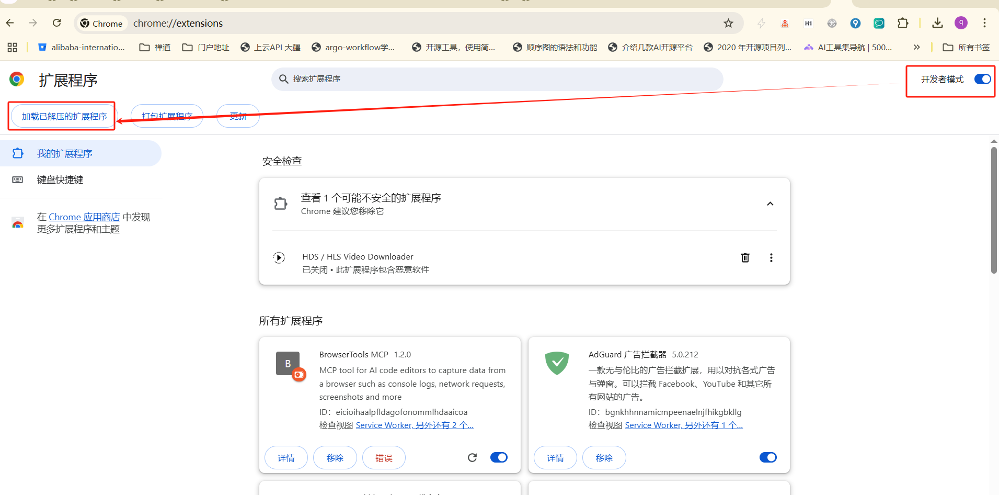
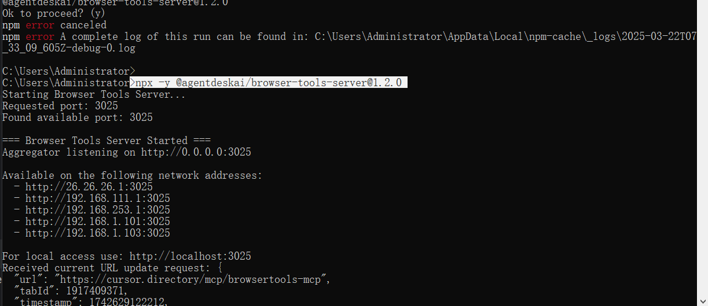
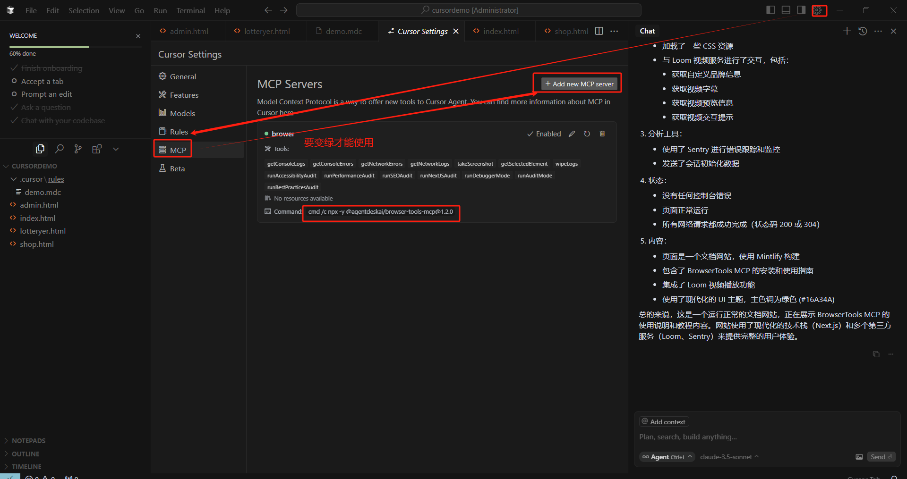
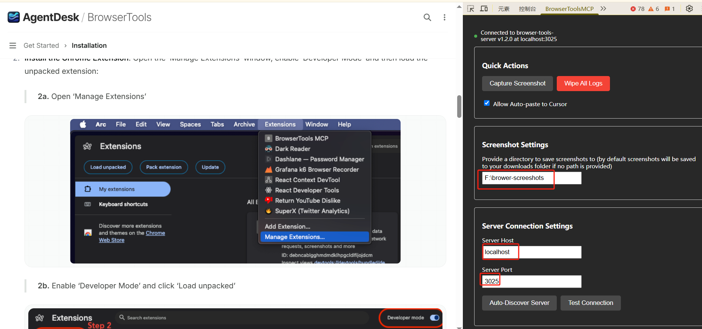
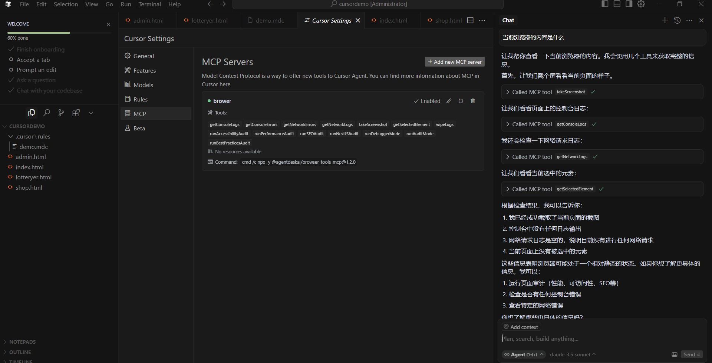

# Windows系统 Cursor 安装 browser-tool

#### 必备工具
1.nodejs

2.chrome

3.cursor

#### 安装步骤

1.下载安装chrome浏览器插件
从github上安装
git clone https://github.com/AgentDeskAI/browser-tools-mcp.git
然后进行安装


2.安装nodejs(省略)

3.启动browser-tool 服务,如下图所示
```bash
npx -y @agentdeskai/browser-tools-server@1.2.0
```


4.cursor配置MCP(我的cursor的版本为:0.46.11)
 配置如下图


5.验证
在浏览器测，如下图


cursor如下图


多种MCP工具: https://cursor.directory/mcp
参考： https://browsertools.agentdesk.ai/installation#requirements
mcp协议: https://docs.cursor.com/context/model-context-protocol