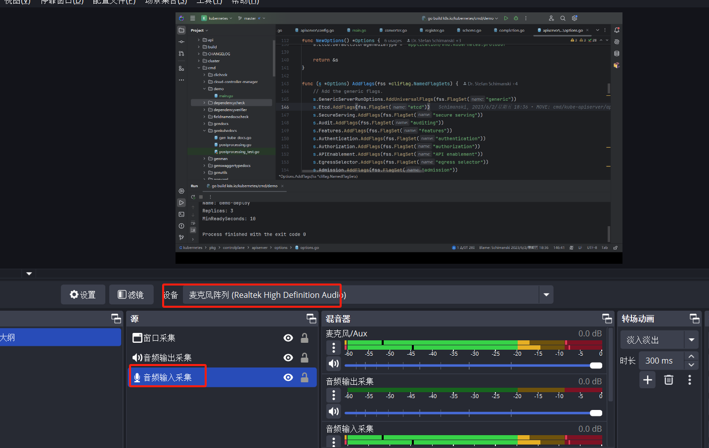

[HttpCanary](https://github.com/MegatronKing/HttpCanary) 

[Reqable](https://reqable.com/zh-CN/)

[Reqable github](https://github.com/reqable/reqable-app)
####  Reqable(HttpCanary) = Fiddler + Charles + Postman

雷电模拟器

 

## 声音设置

