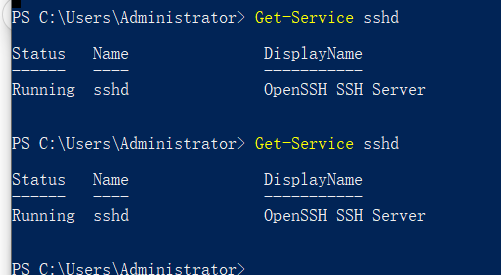
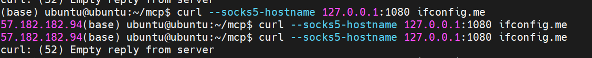

## 一.windows安装ssh 并启动ssh 

1.通过下面的文字查看是否已经安装有ssh,如果没有安装就
```powershell
Get-WindowsCapability -Online | Where-Object Name -like 'OpenSSH*' //检查是否已安装
Add-WindowsCapability -Online -Name OpenSSH.Server~~~~0.0.1.0  //安装
Get-WindowsCapability -Online | Where-Object Name -like 'OpenSSH*' //检查安装是否成功
```
另一种安装方法
```powershell
Add-WindowsFeature -Name OpenSSH-Server
```
启动
```powershell
Start-Service sshd
Set-Service -Name sshd -StartupType Automatic
```
开启22端口
```powershell
New-NetFirewallRule -DisplayName "Allow SSH" -Direction Inbound -Protocol TCP -LocalPort 22 -Action Allow
New-NetFirewallRule -DisplayName "Allow SSH" -Direction Inbound -Protocol TCP -LocalPort 22 -Action Allow
```

查看是否启动成功
```powershell
Get-Service sshd
```

## 二.ubuntu系统
ubuntu开启转发功能:
```bash
sudo sysctl -w net.ipv4.ip_forward=1
```

ubuntu系统下启动VPN地址
```bash
ssh -i ~/.ssh/id_rsa -D 0.0.0.0:1080 -N -p 22 administrator@windows系统IP
```
安装 redsocks 和 iptables
```shell
sudo apt install redsocks iptables -y
```
配置redsocks
```shell
vim /etc/redsocks.conf
(base) ubuntu@ubuntu:~$ cat /etc/redsocks.conf
base {
    log_debug = off;
    log_info = on;
    log = "file:/var/log/redsocks.log";
    daemon = on;
    redirector = iptables;
}

redsocks {
    local_ip = 127.0.0.1;
    local_port = 12345;
    ip = 127.0.0.1;
    port = 1080;
    type = socks5;
    // login = "optional";
    // password = "optional";
}

```
启动
```shell
sudo redsocks -c /etc/redsocks.conf -p /var/run/redsocks.pid
```
查看redsocks日志
```shell
/var/log/redsocks.log
```
配置地址iptables
```shell
sudo iptables -t nat -N REDSOCKS
sudo iptables -t nat -A REDSOCKS -d 127.0.0.0/8 -j RETURN
sudo iptables -t nat -A REDSOCKS -d 192.168.1.0/24 -j RETURN
sudo iptables -t nat -A REDSOCKS -p tcp -j REDIRECT --to-ports 12345
sudo iptables -t nat -A OUTPUT -p tcp -j REDSOCKS
```

设置环境变量
```shell
export ALL_PROXY="socks5h://localhost:1080"
export http_proxy="socks5://ubuntuIP:1080"
export https_proxy="socks5://ubuntuIP:1080"
```
验证ubuntu下通过windows的vpn科学上网是否成功,出现VPN IP就表明流量引流成功
```bash
curl ifconfig.me
```


