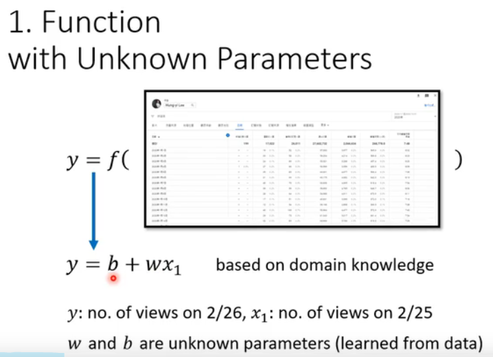

1. Regression 回归
2. Classification 分类
3. Structured Learning
4. Twiter(X)

#### 机器学习建模过程
1. 找函数 比如 y=b+wx1 
2. w weight ; b bit
3. LOSS L(b,w) LABLE(真实值)
4.  MAE MSE
5. 优化(Optimization) 
6. 学习率 
7. 超参数 hyperparameters 
8. Local minima ; global minima 
9. 
10. 训练(写函数 定义loss 优化)
11. 有监督