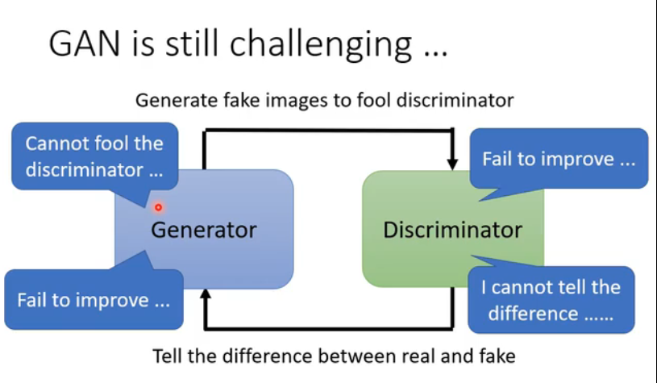

#### 训练难度

1. Generator 
2. Discriminator
3. More Tips

4. Scratch GAN 
5. VAE Variational Autoencoder 
6. FLOW-based Model

#### 评估 Generator (Evaluation)

1. Mode Collapse(模型崩溃)
2. Mode Dropping(模型下降)
3. 多样性

4. Quality(质量) Diversity(多样性)

5. 弗雷歇距离

6. 各种各样的GAN

7. GAN 评估方式

8. text-to-image
9. 有条件的 Conditional GAN

10. image-to-image

11. sound-to-image
