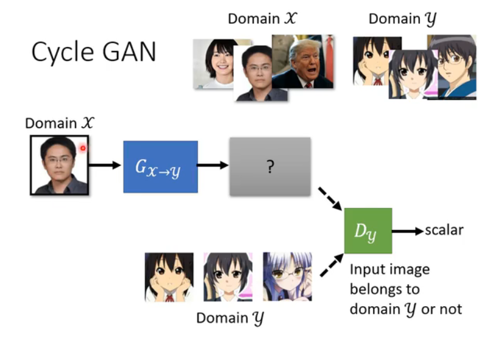
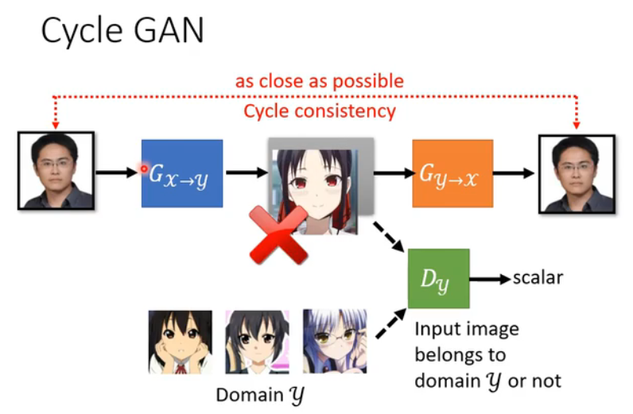
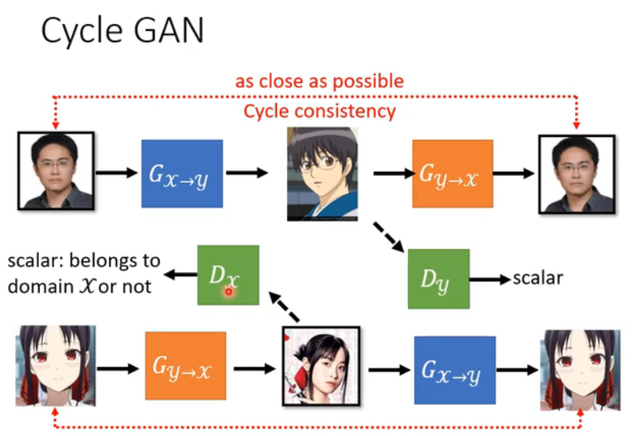
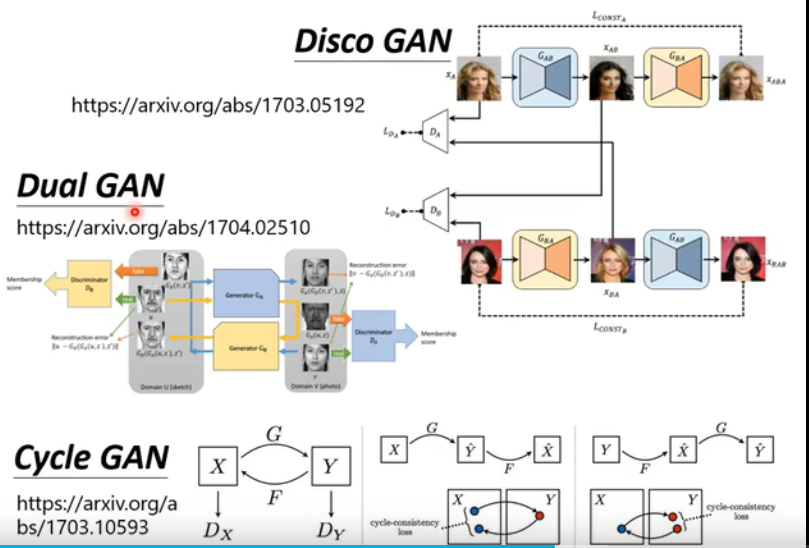
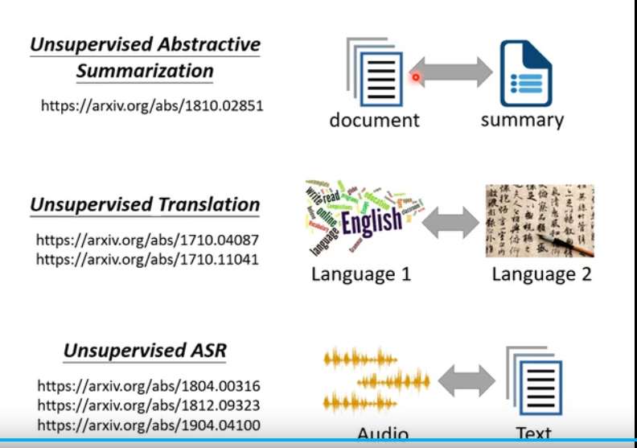

#### 没有成对的资料 没有标签
1. Learning from unpaired data
2. Domain X
3. Domain Y

#### Cycle Gan and  Dual Gan and Disco Gan

#### Text Style Transfer
1. 负面转换成正面的句子
2. document
3. 翻译
4. Audio(语音) ---> 文本
