#### self-attention
dot producer
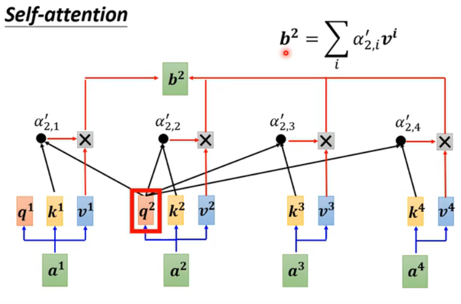

#### Q K V

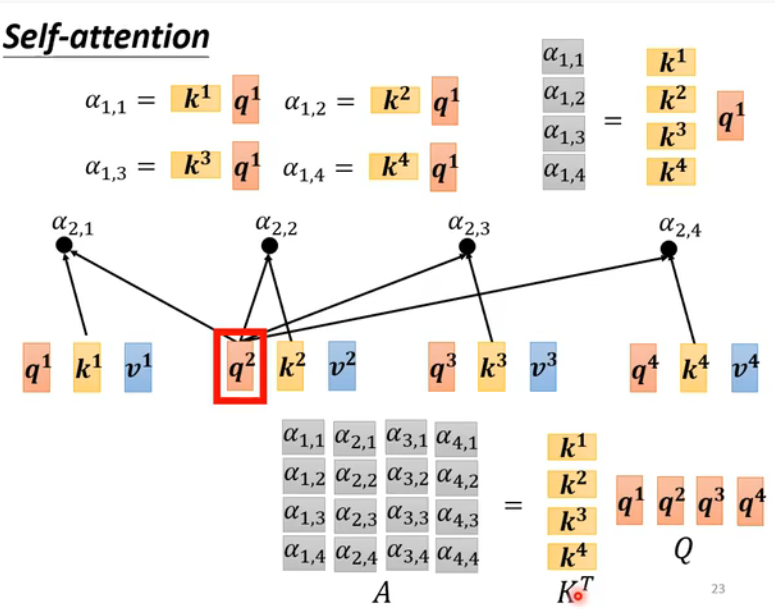

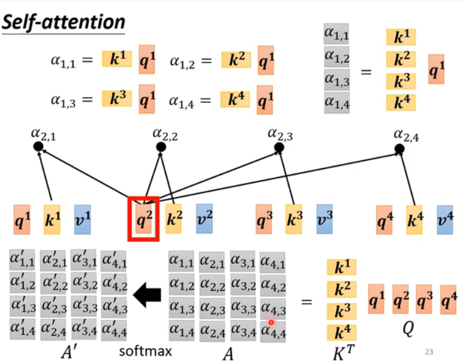

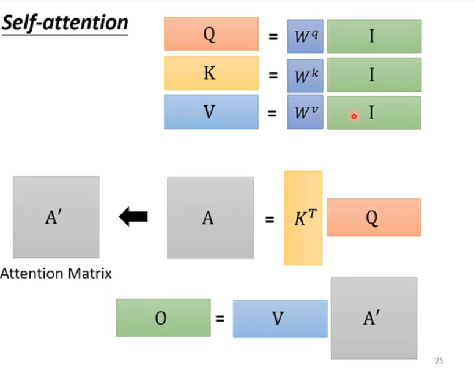

#### multi-head self-attention

#### 位置编码(positional encoding)
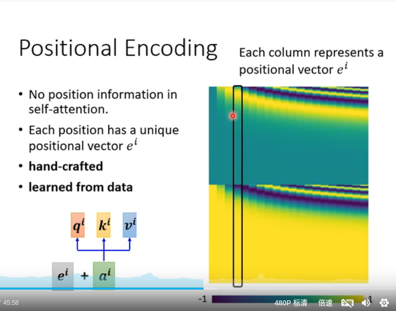

#### 声音 自注意力机制 speech (Truncated self-attention)
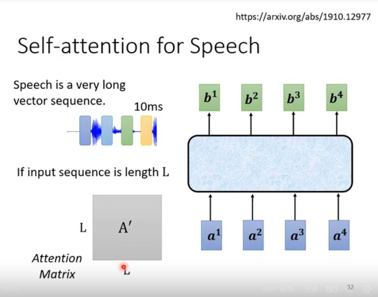

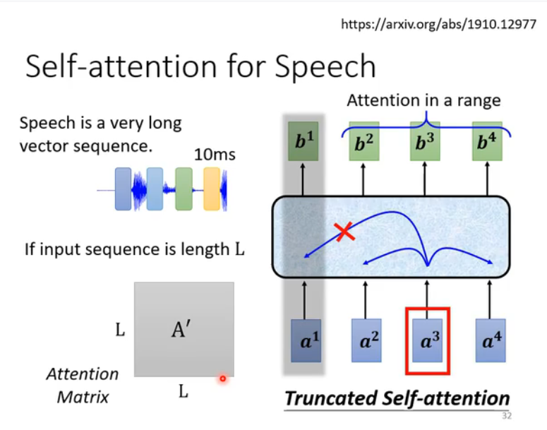

#### 图片自主力机制
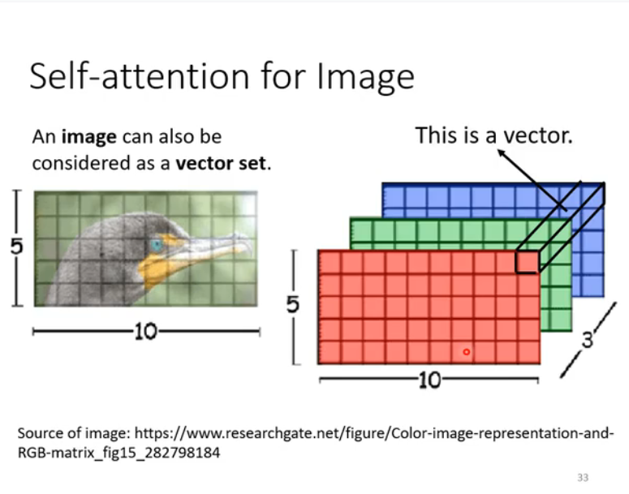

#### self-attention v.s. CNN
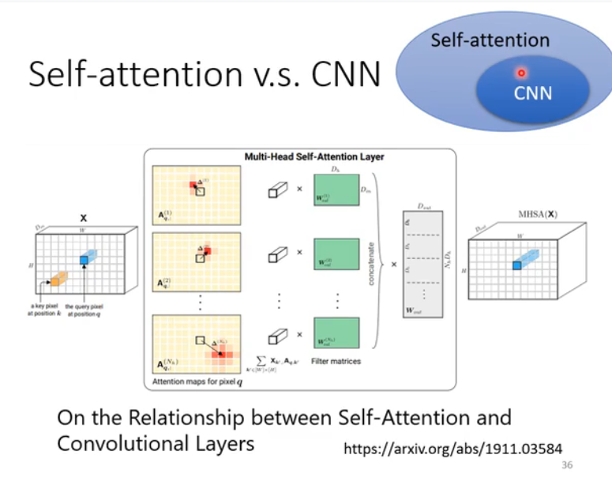

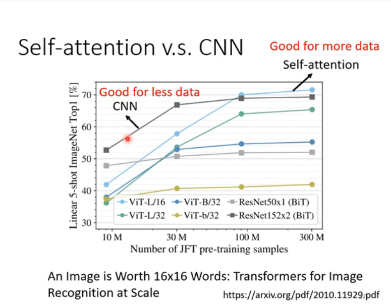

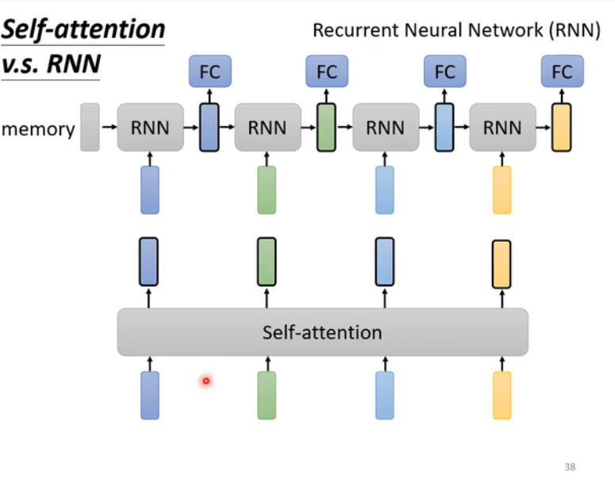

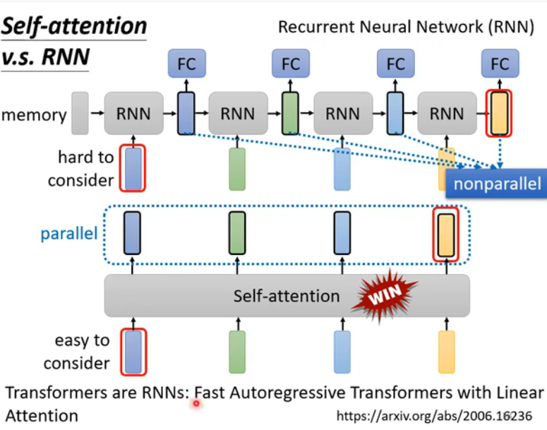

#### 自主力机制-图graph

#### GNN 

#### self-attention其他模型的变形
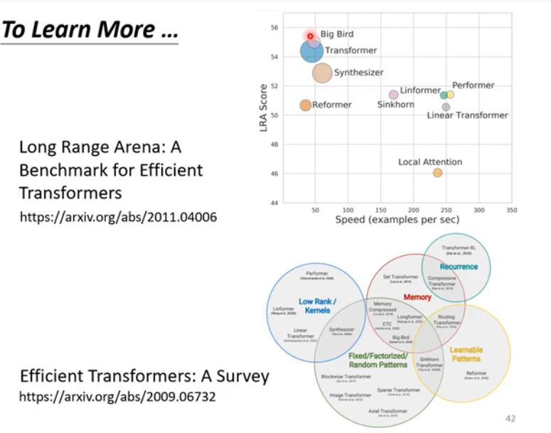

