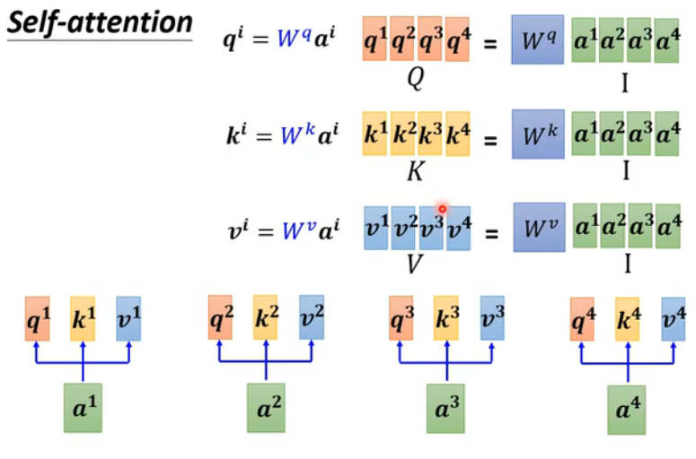
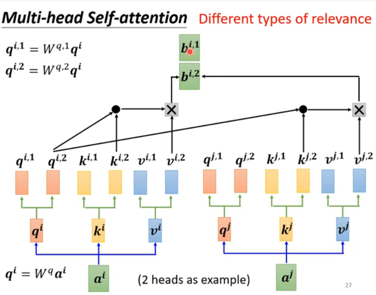

#### self-attention
dot producer

#### Q K V

#### multi-head self-attention

#### 位置编码(positional encoding)

#### 声音 自注意力机制 speech (Truncated self-attention)

#### 图片自主力机制

#### self-attention v.s. CNN

#### 自主力机制-图graph

#### GNN 

#### self-attention其他模型的变形

