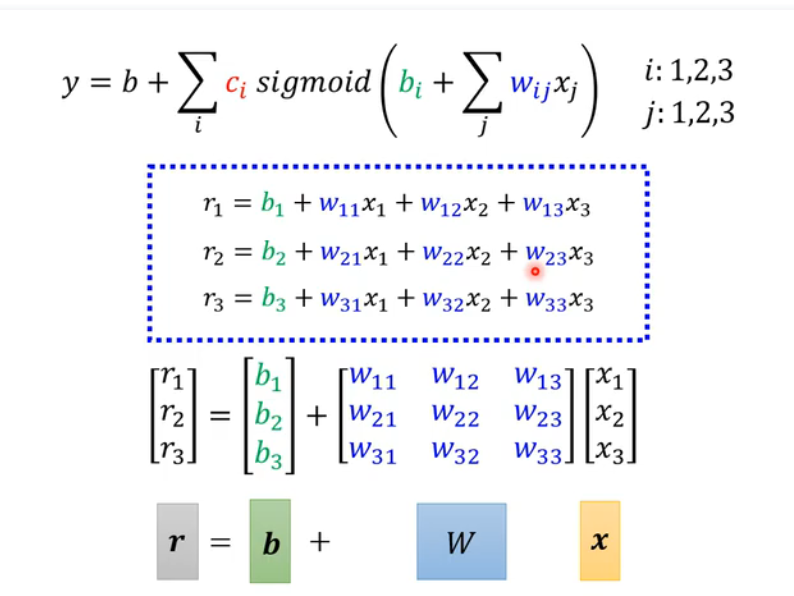
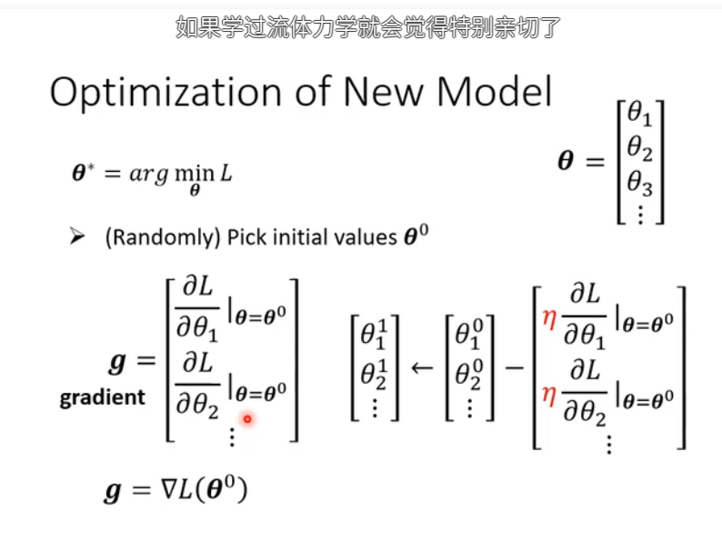

#### 1. sigmoid 

$$
y = c \frac{1}{1 + e^{-(b + wx_1)}}
$$

The formula is $y = c \frac{1}{1 + e^{-(b + wx_1)}}$.

### sigmoid 

### optimization

### gradient x向量积分

### ReLU 激活函数

### 神经元 Neuron 

### AlexNet VGG GoogleNet ResidualNet Taipei

### Overfitten

