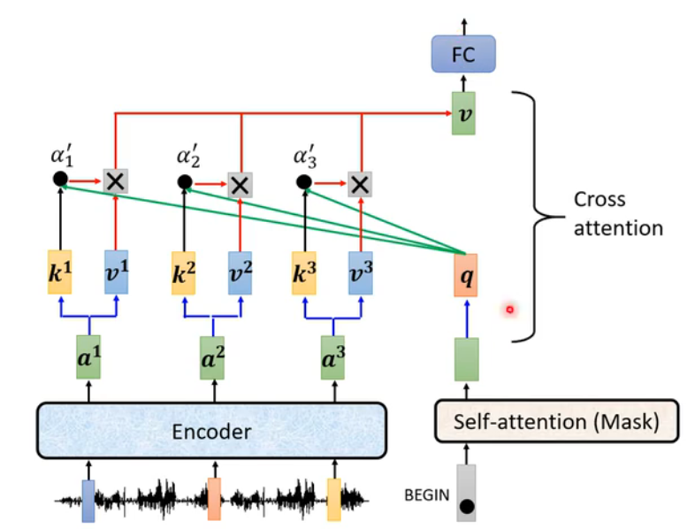

#### why masked

#### BEGIN and  stop Token
1. BEGIN 开始  STOP 结束

#### NAT 

#### Cross Attention

#### 训练IP
##### 1.Copy Mechanism
* 1.聊天机器人chat-bot

##### pointer network

#### Guided Attention 指引注意力

#### Beam Search

Beam Search（束搜索）是一种用于序列生成任务的启发式搜索算法，广泛应用于自然语言处理(NLP)中的各种模型，包括Transformer模型。它是一种优化过的搜索策略，旨在找到最可能的输出序列。

### 基本概念

在序列生成任务中，如机器翻译、文本摘要或语音识别，模型需要根据输入序列生成一个输出序列。每个输出词都是基于之前生成的所有词的概率分布来选择的。贪婪搜索可能会导致次优解，因为它总是选择当前时间步概率最高的词，而不考虑未来的可能性。与之相对，Beam Search通过保持多个候选路径（束宽度为k），并在这k个最佳路径上继续扩展，直到完成整个序列的生成，从而提供了一种折衷方案，既考虑了未来可能性，又不至于像穷举法那样计算量过大。

### 工作原理

1. **初始化**：从起始标记开始，计算第一个词的概率分布。
2. **扩展**：对于每一个当前序列，扩展出下一个词的所有可能，并计算这些新序列的概率（即原序列的概率乘以新增词的概率）。
3. **剪枝**：保留概率最高的前k个序列作为下一轮的基础，这里k就是束宽（beam width）。束宽决定了算法在每一步考虑多少个最好的候选序列。
4. **重复**：重复步骤2和3，直到达到预定的序列长度或者遇到结束标记为止。
5. **选择结果**：最终，得分最高的序列被视为最佳输出。

### 在AI Transformer中的应用

在Transformer模型中，Beam Search被用来生成文本预测。由于Transformer架构能够并行处理序列数据，这使得Beam Search可以在这种架构上高效运行。具体来说，在生成阶段，Transformer模型会为每个时间步的每个词预测下一个词的概率分布，然后Beam Search算法利用这些概率来决定接下来要生成的词，同时保持多个候选序列，以便探索不同的输出路径，从而提高生成文本的质量。

总的来说，Beam Search提供了一种有效的方法来平衡计算成本和生成质量，是现代NLP任务中不可或缺的一部分。

#### 评估指标

#### Scheduled Sampling
