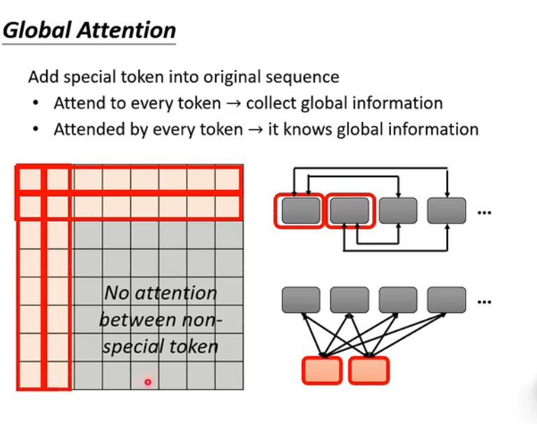
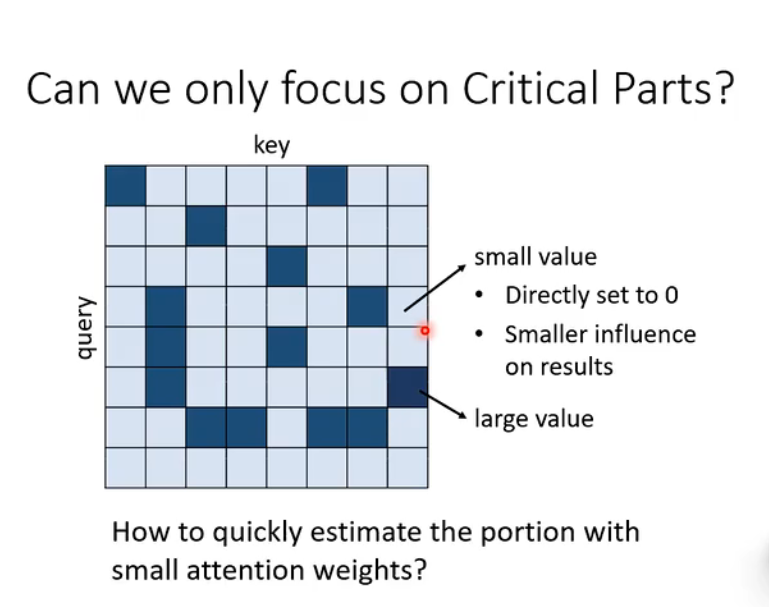
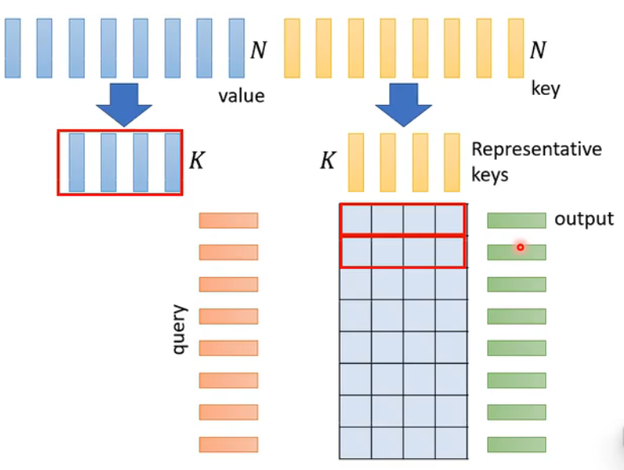

### local attention/truncated attention(比如: 邻居attention)
### stride attention

### global attention

### Longformer Big Bird

### Clustering 技术(Reformer and Routing Transformer)

### Learnable patterns(sinkhorn sorting network)

### Linformer

#### Compressed attention(有代表性的key)

#### attention mechanism is three-matrix multiplication

### Realization

### Synthesizer

