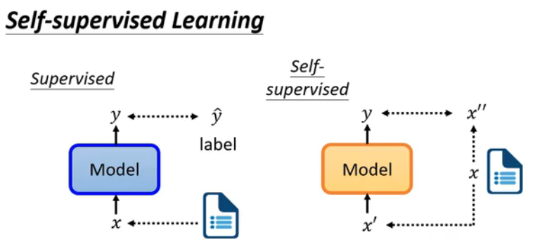
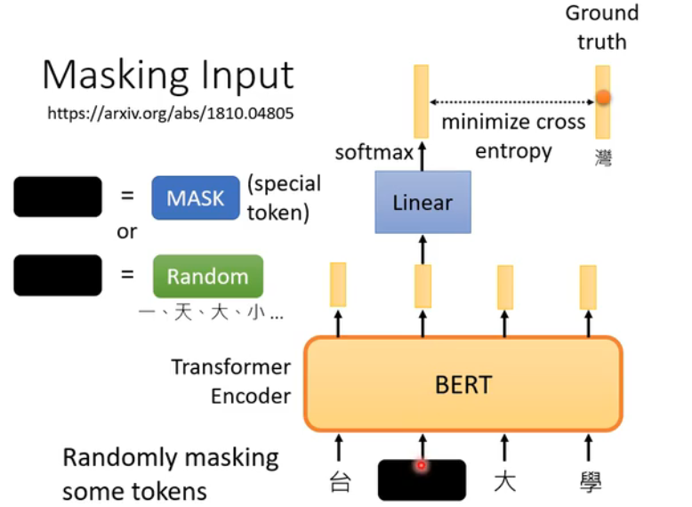
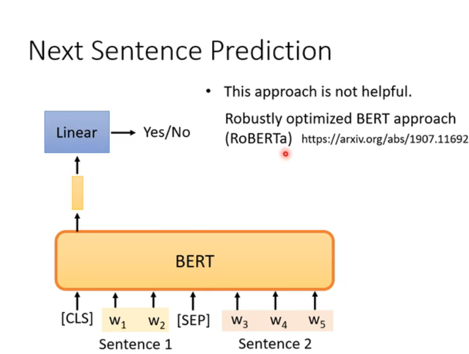
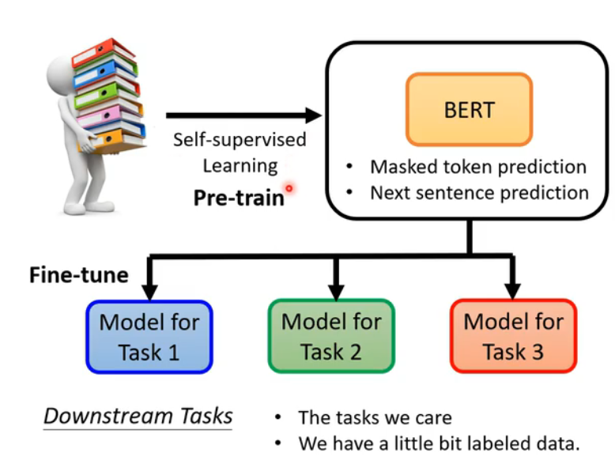
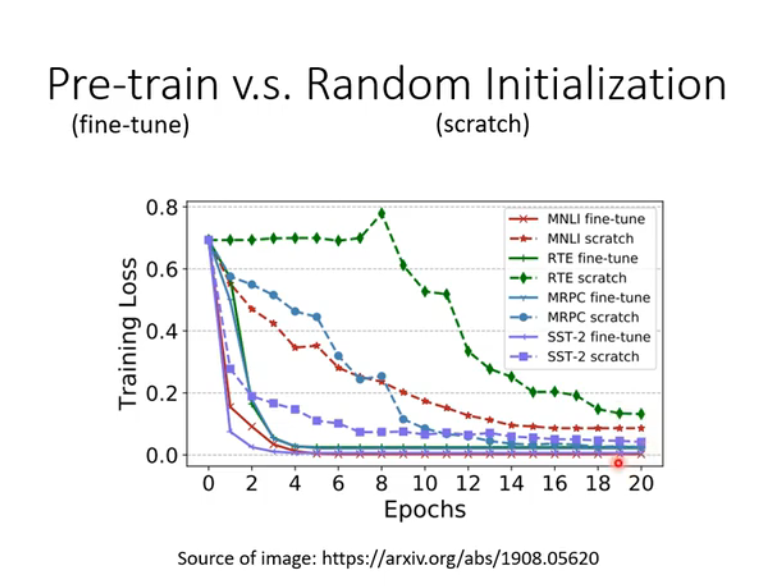
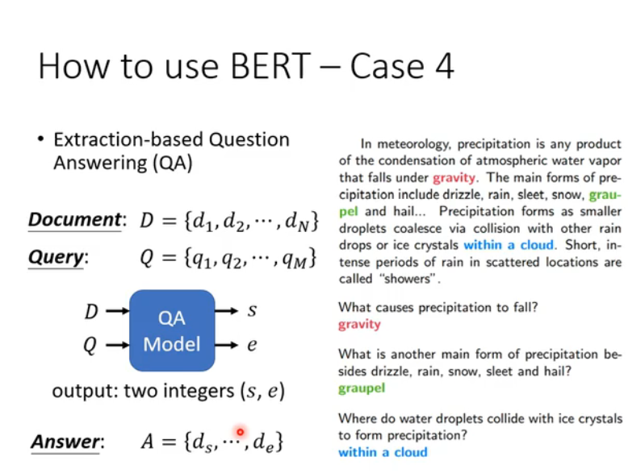
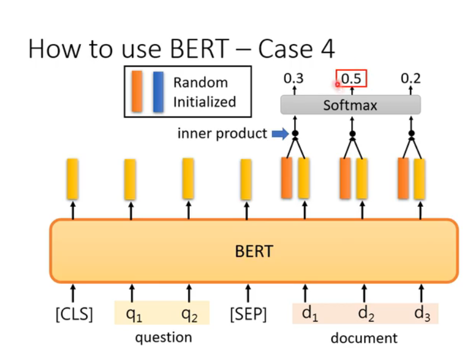
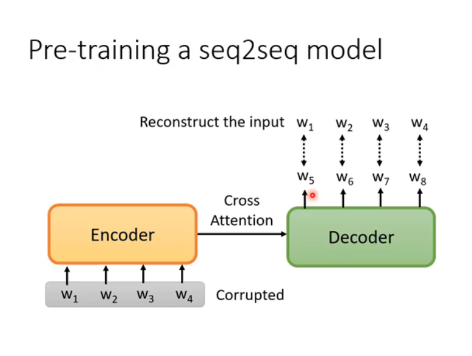
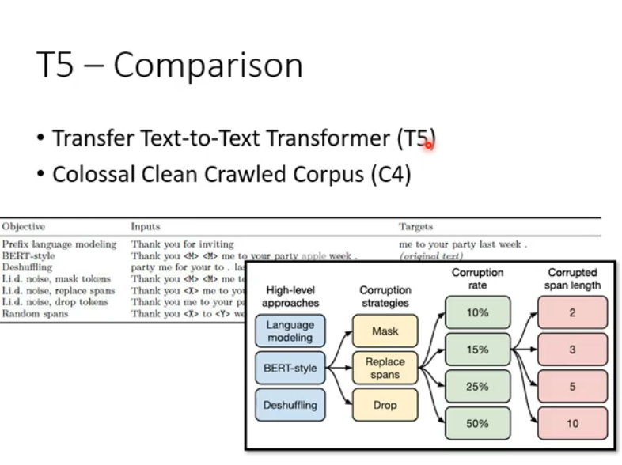

#### supervised 自监督学习

#### bert模型

1. 这两个句子是否是相接的

2. Linear
   在AI模型中，“linear”通常指的是线性操作或线性层（Linear Layer），它是一个非常基础且重要的组成部分，尤其是在深度学习领域。线性层主要执行的是输入数据的线性变换，这种变换可以被理解为对输入数据进行加权求和加上偏置项的过程。下面详细介绍其作用：

### 1. 基本功能

- **线性变换**：在线性层中，每个输入特征通过一组权重与输出特征相连接，这些权重构成了一个权重矩阵。对于给定的输入向量 \(x\)，线性层计算输出 \(y = Wx + b\)，其中 \(W\) 是权重矩阵，\(b\) 是偏置向量。

### 2. 在神经网络中的角色

- **特征转换**：线性层能够将输入从一个特征空间映射到另一个特征空间。这对于调整模型的表达能力非常重要，因为它允许模型根据训练数据自动学习最有效的特征表示。

- **维度调整**：线性层常用于改变输入数据的维度大小。例如，在全连接层（Fully Connected Layer）中，它可以帮助调整不同层之间的维度匹配问题。

### 3. 非线性前的准备

虽然单独的线性层只能实现线性变换，但当它们与非线性激活函数结合使用时，就能构建出能够近似任何复杂函数的多层感知机（MLP）。这是因为非线性激活函数打破了输入与输出间的线性关系，使得深层网络可以学习数据中的复杂模式。

### 4. 应用实例

- **分类和回归任务**：在许多机器学习任务中，如图像分类、语音识别或自然语言处理，线性层通常作为最后几层之一，用来将高维特征向量转换成预测结果所需的维度，比如类别数或连续值预测。

- **Transformer模型**：尽管Transformer架构以自注意力机制为核心，但它也广泛使用了线性层来处理查询、键、值的转换以及最终的输出转换。

总之，线性层虽然是简单的数学运算，但在AI模型中起着至关重要的作用，它是构建复杂模型的基础组件之一。通过合理设计和组合线性层与其他类型的层，可以创建出强大的模型来解决各种实际问题。

## BART

