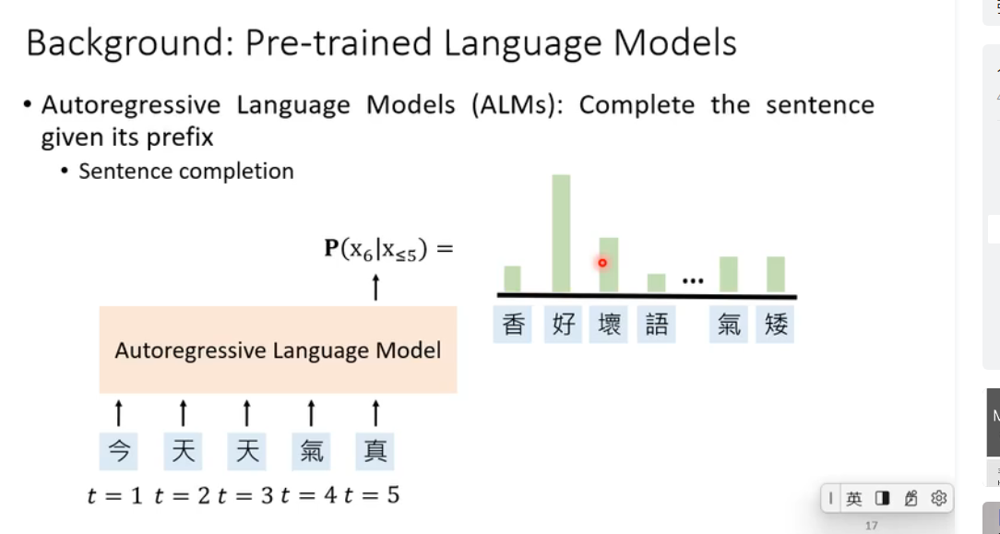

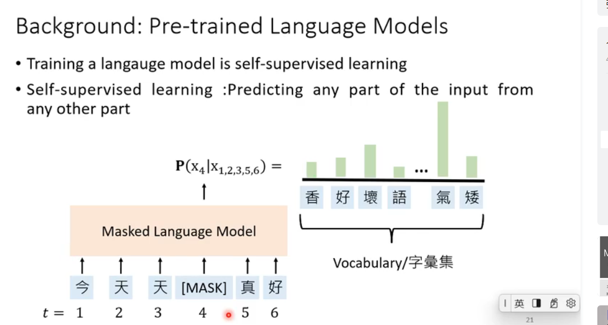

#### pre-train
#### fine-train
#### prompt-train
1. a prompt-template
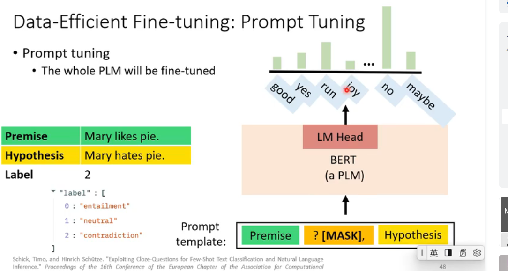
2. diff prompt fine-train
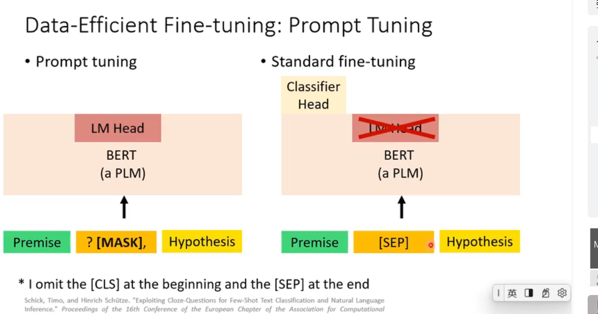
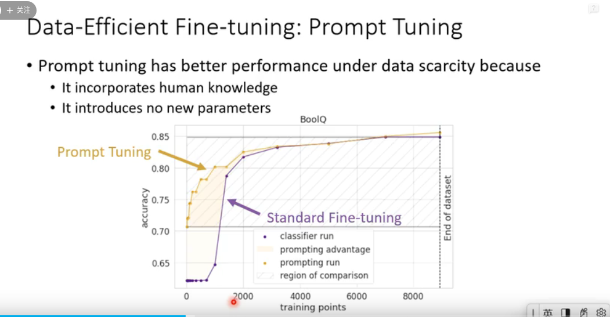
3. few-shot-learning
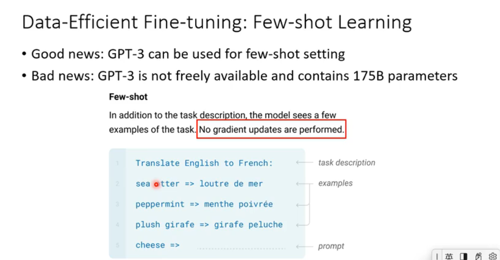
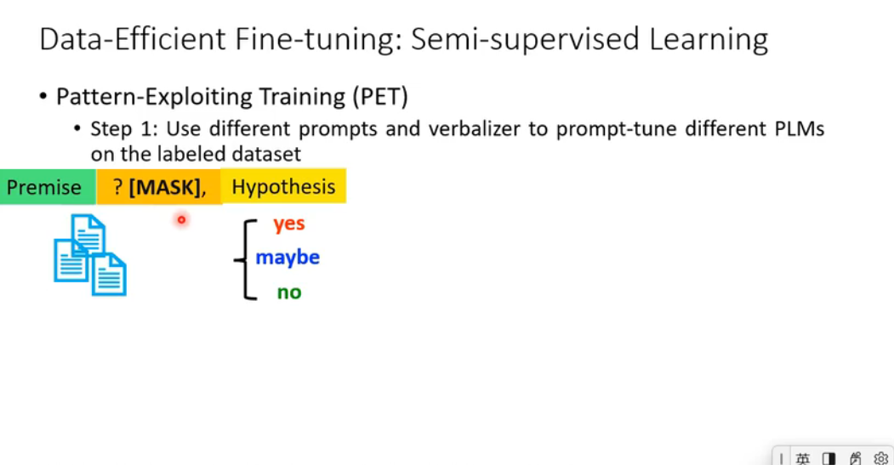
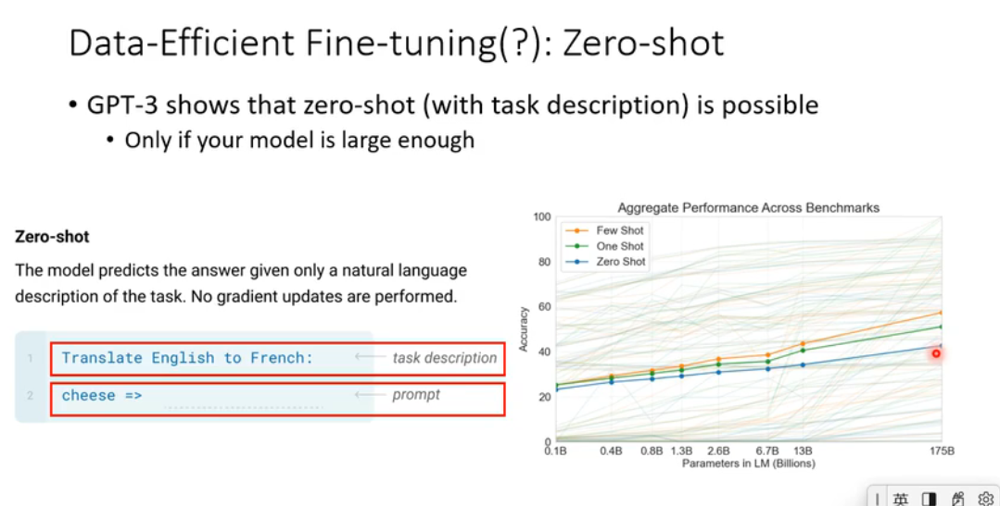
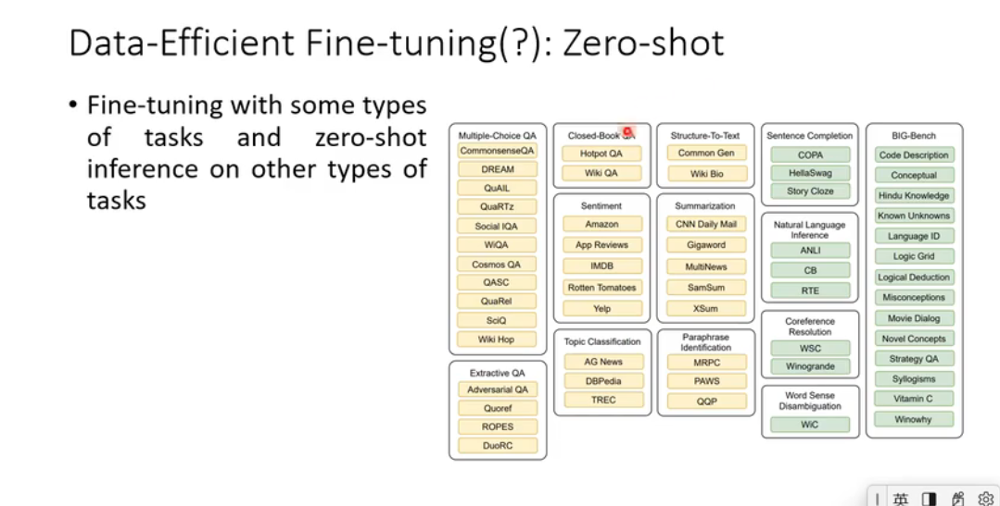
4. 模型蒸馏
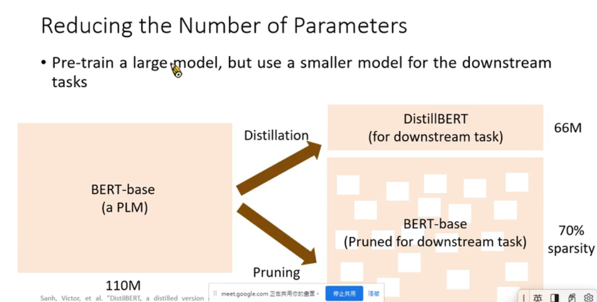
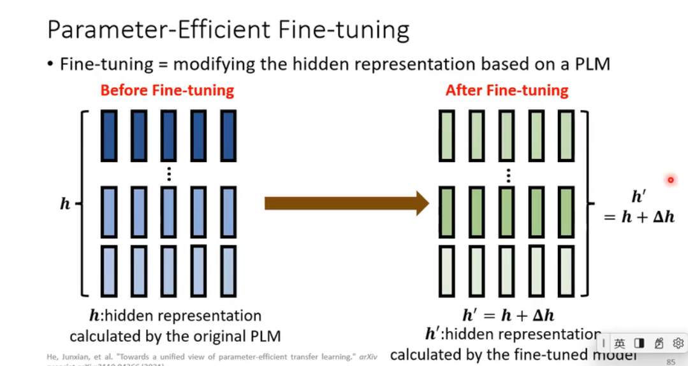
5. adapter
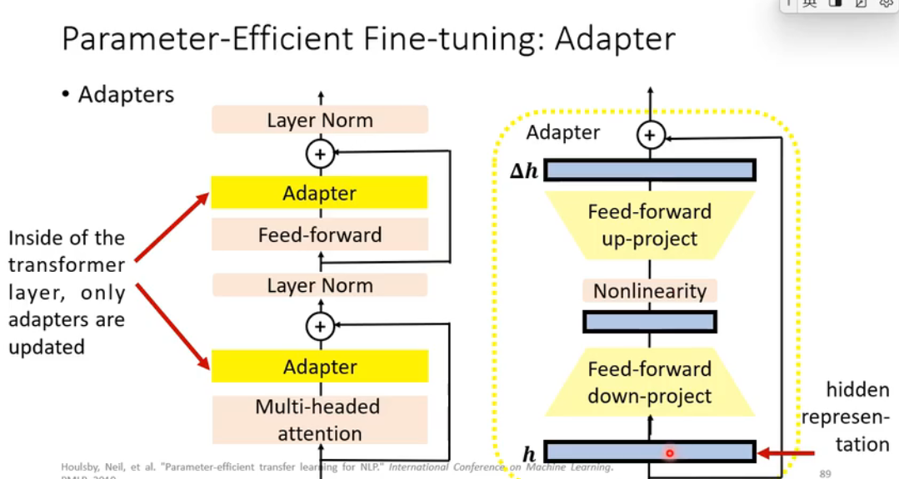
6. LoRA (Low of Rank Adapter)
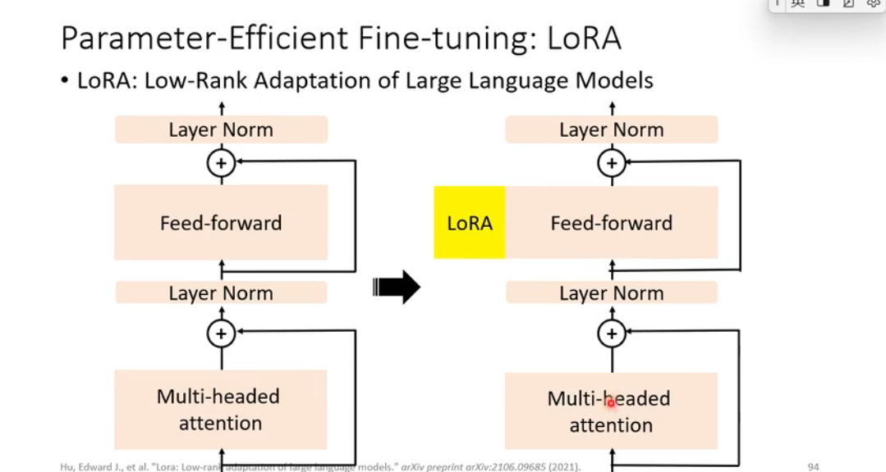
7. prefix tuning
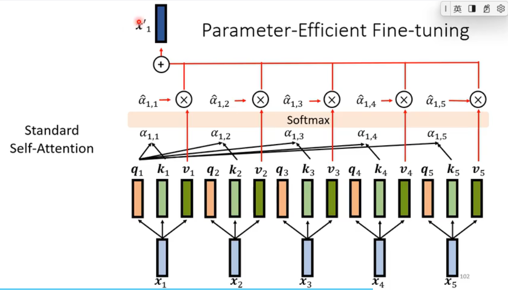
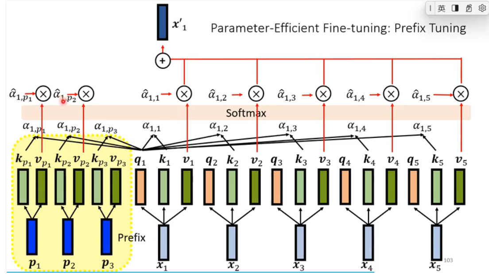
8. soft prompting
9. hard prompting

10. 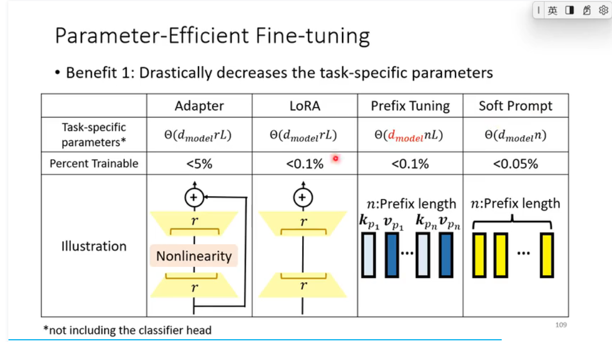
