## Downstream Model

##  self-supervised Learning for Speech

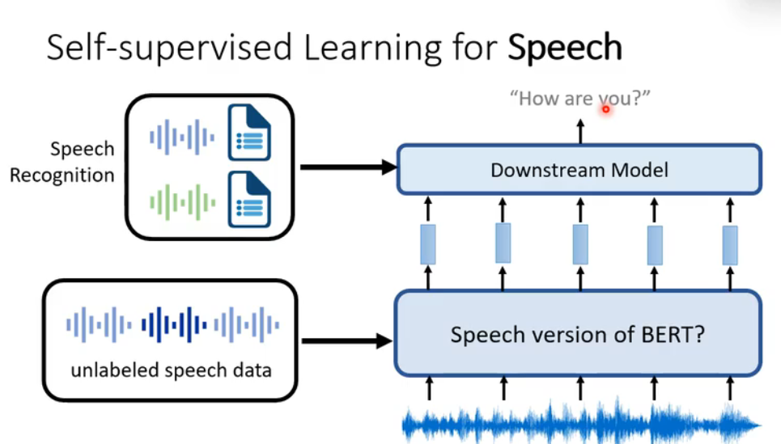

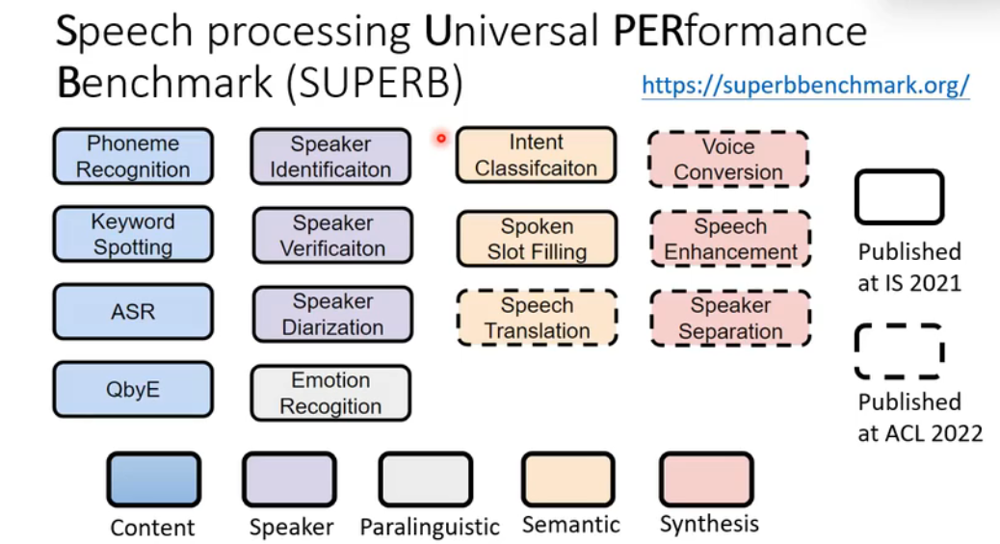

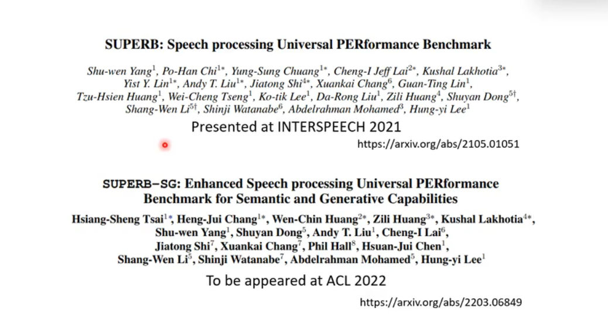

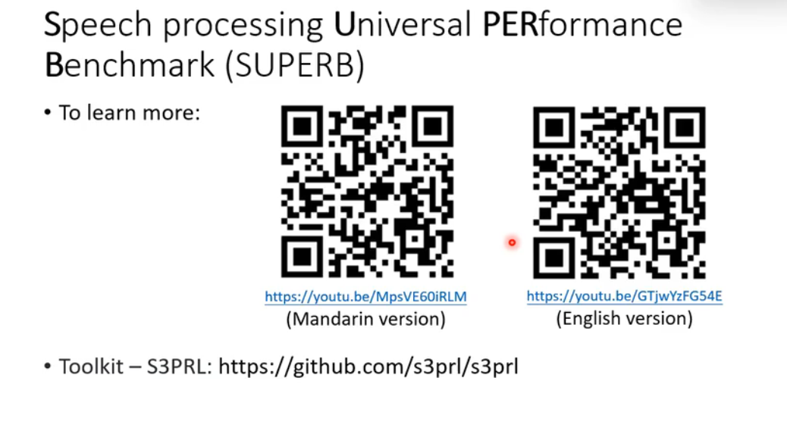

## Self-supervised Learning for Image
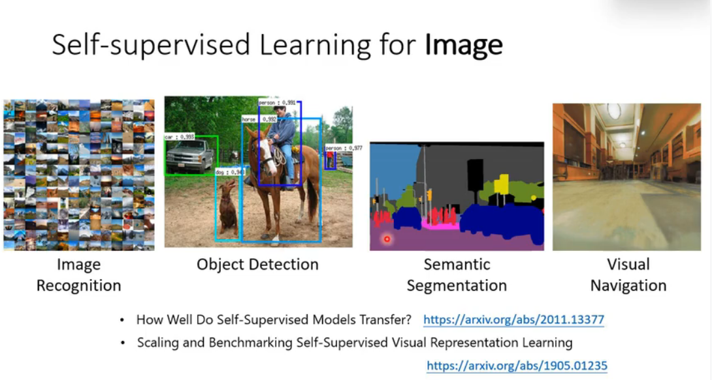

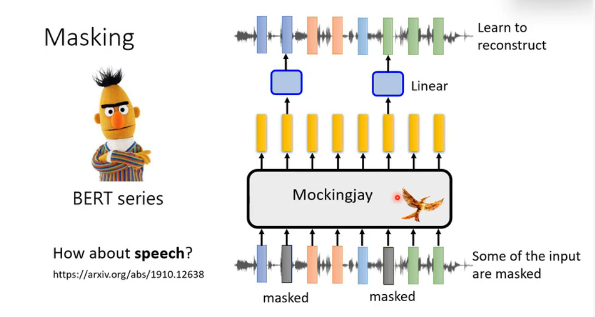

## Smoothness of acoustic features
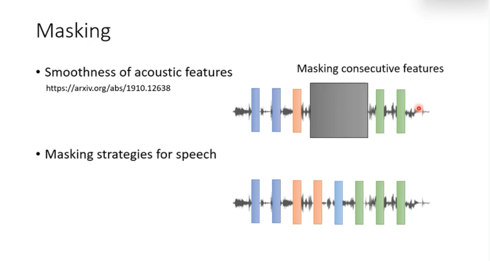

## GPT Series speech
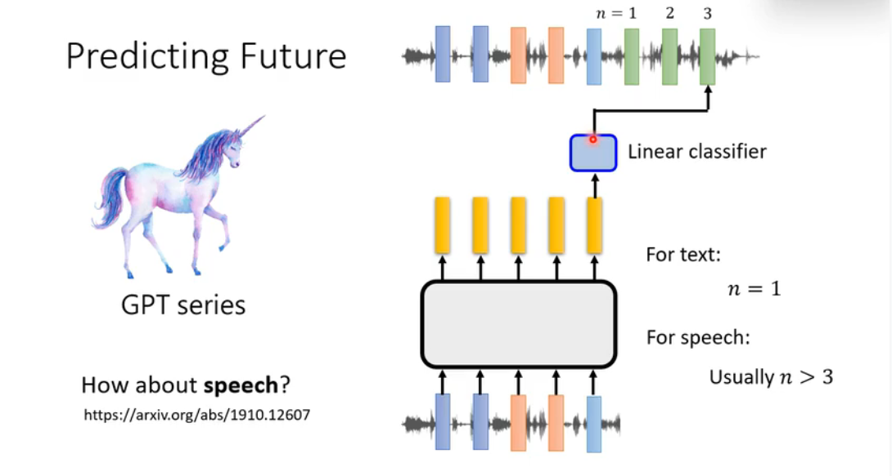

## Predictive Approach
### Image-Predicting Rotation

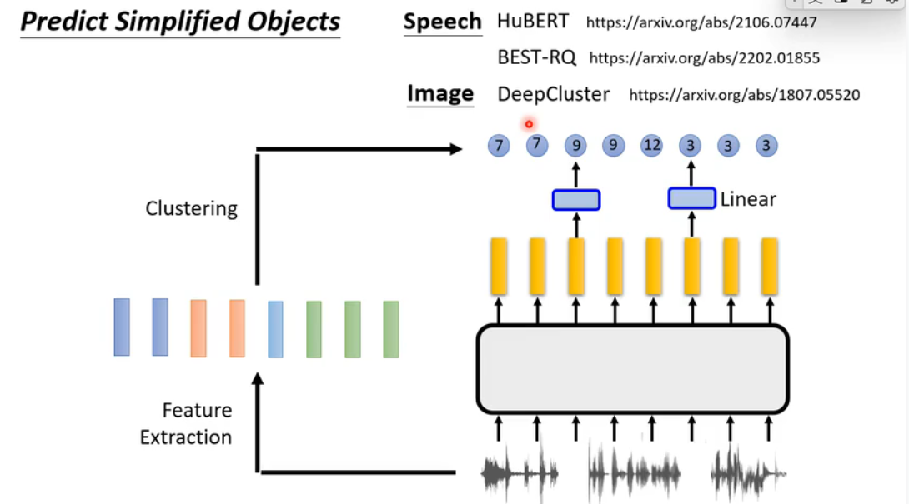

## Contrastive Learning

### SimCIR
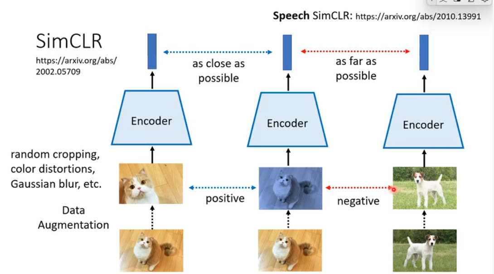

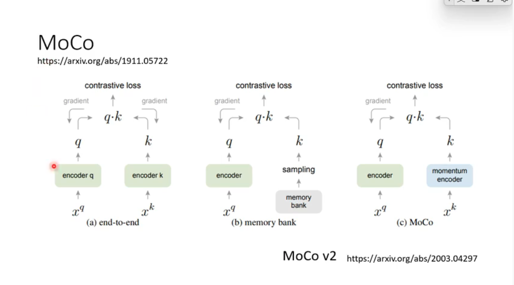

## Contrastive Learning(对比学习) for Speech
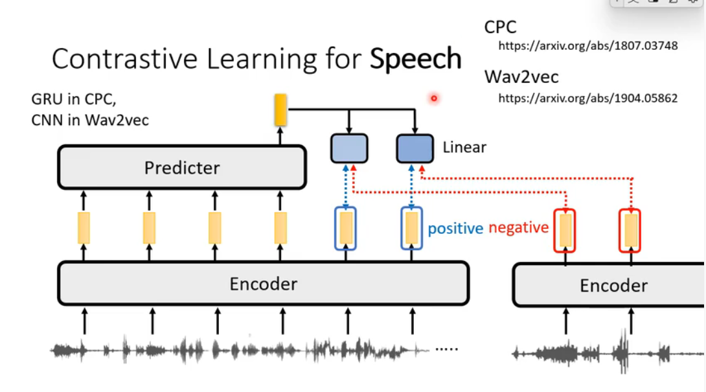
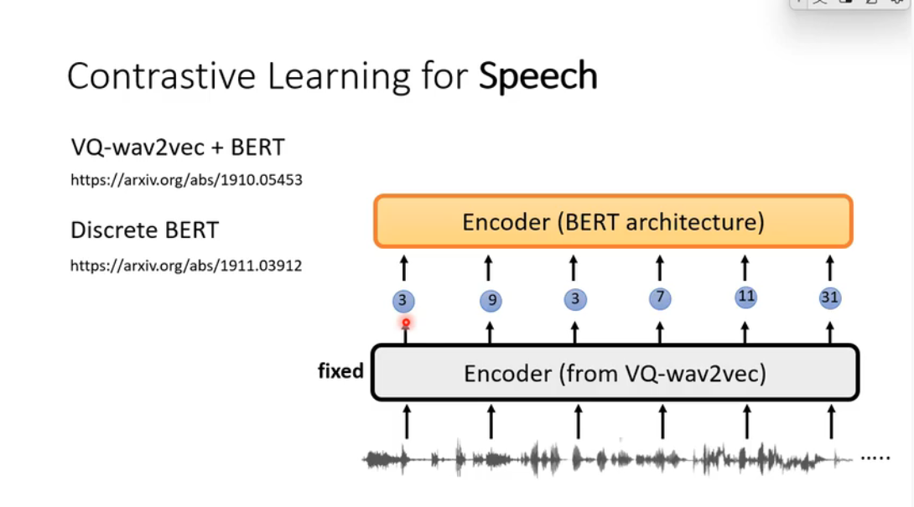

## classification and contrastive
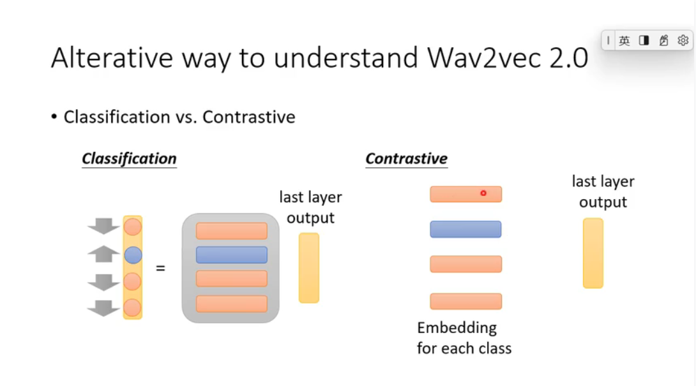
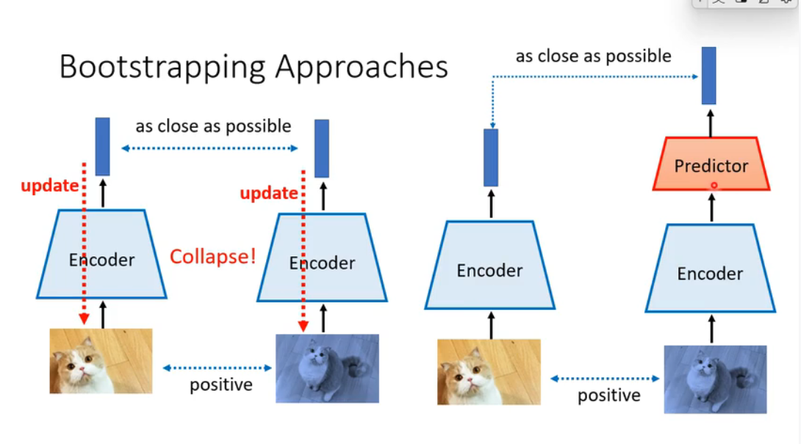
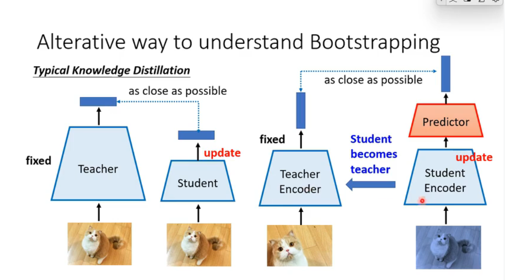
## approaches(方法)
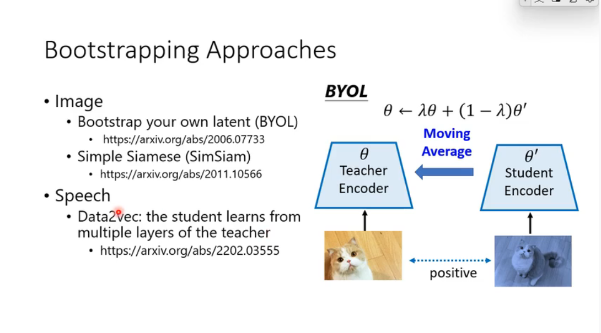

## VICRe

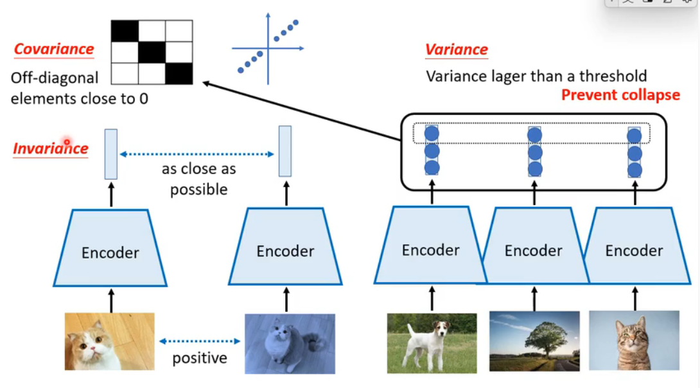

