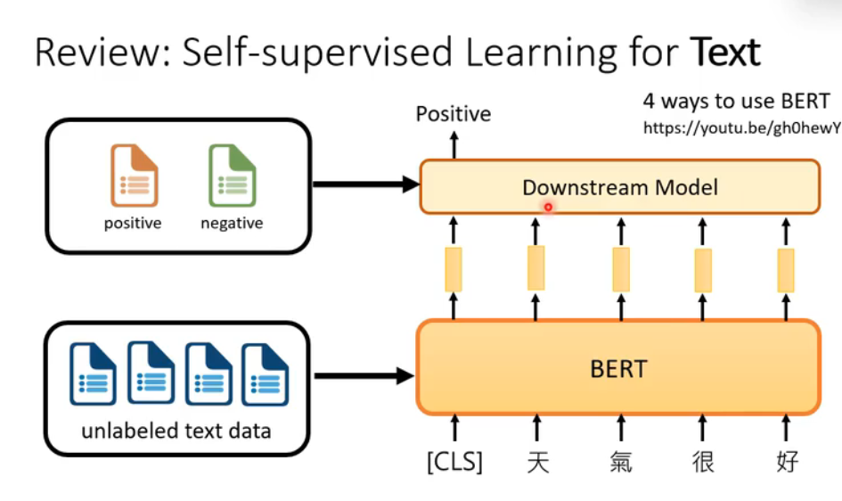
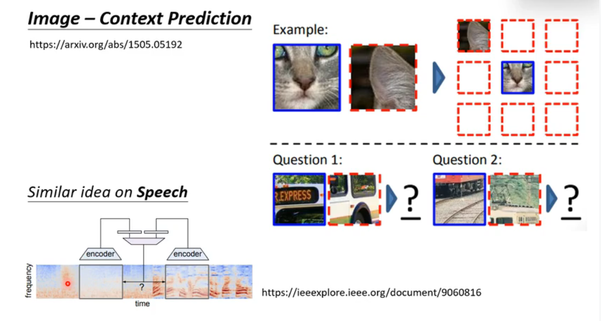
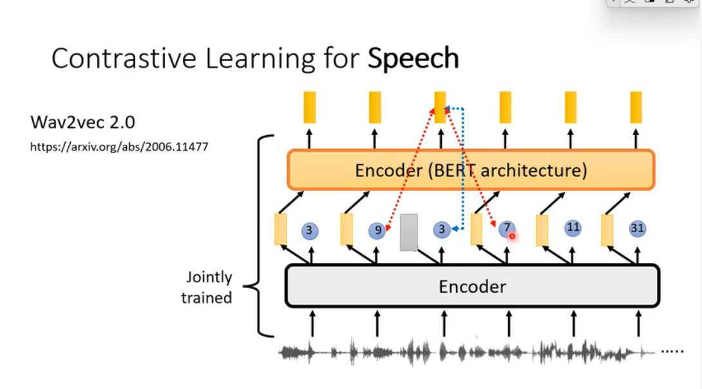

## Downstream Model

##  self-supervised Learning for Speech

## Self-supervised Learning for Image

## Smoothness of acoustic features

## GPT Series speech

## Predictive Approach
### Image-Predicting Rotation

## Contrastive Learning

### SimCIR

## Contrastive Learning(对比学习) for Speech

## classification and contrastive

## approaches(方法)

## VICRe

