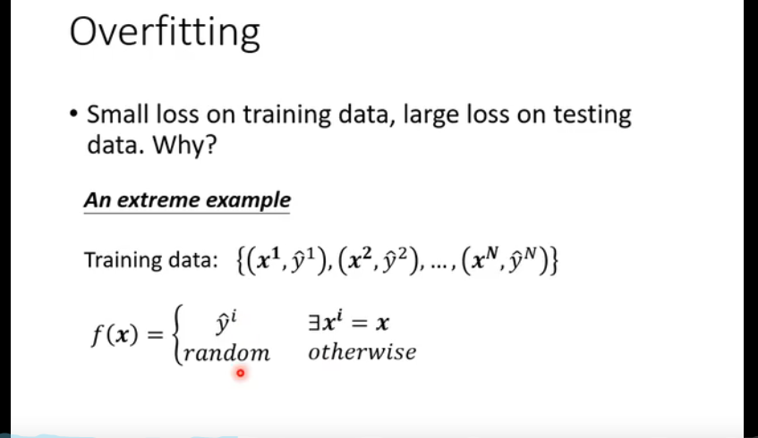
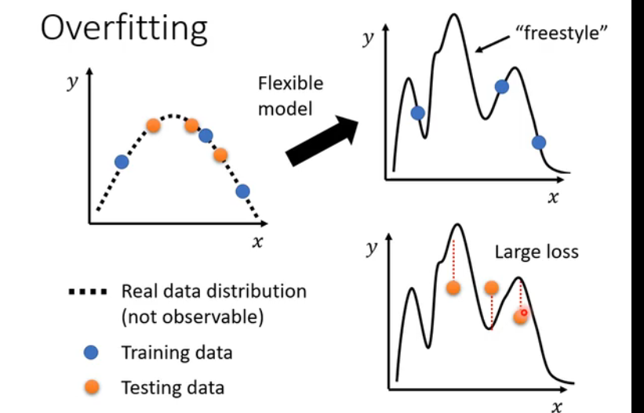
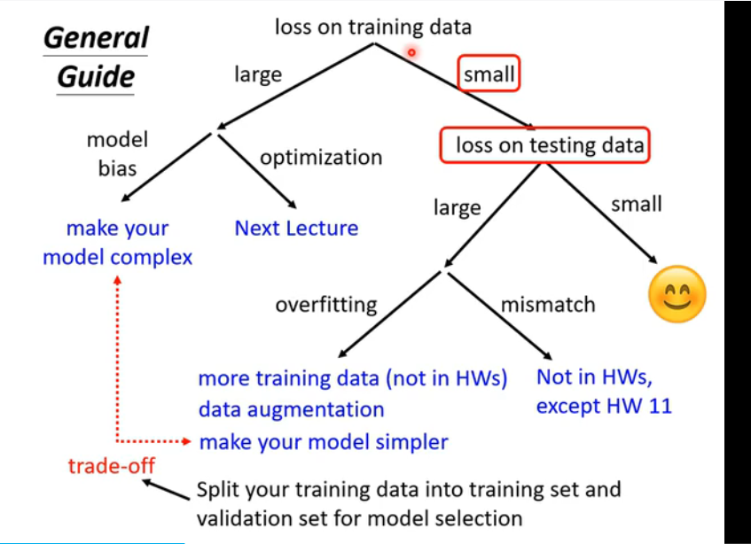

#### model bias
1. **模型太简单**

#### optimization issue

#### 如何判断是model bias的问题 还是optimization

1. Overfitting 过拟合 mismatch

   
  

2. 有可能是数据集导致训练没有效果

3. 

#### 训练数据 cross validation

Training Set (Training Validation)  

public(Testing Set) private(Testing Set)
