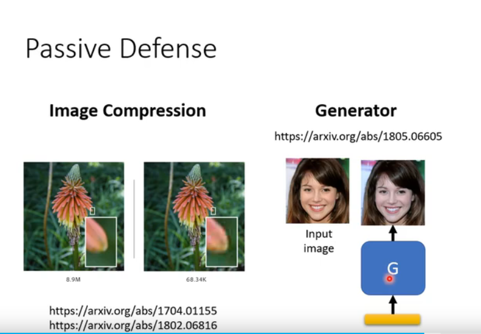

### 攻击

#### 1.逃避攻击

#### 2.模仿攻击
#### 3.后门攻击

#### White Box (白盒攻击)

#### Black Box (黑箱攻击)
1. black network
2. proxy network

3. 
4. 
#### 单像素攻击(One pixel attack)
#### Universal Adversarial Attack(通用对抗攻击)
#### Adversarial Reprogramming

#### 开后门 Backdoor in Model 
在训练数据做手脚

### 防御
#### 模糊化图片
#### 压缩图片
#### Generator

#### 加上随机性 Randomization

#### Adversarial Training

