### Multi Bert (跨语言)
####  预训练 微调 
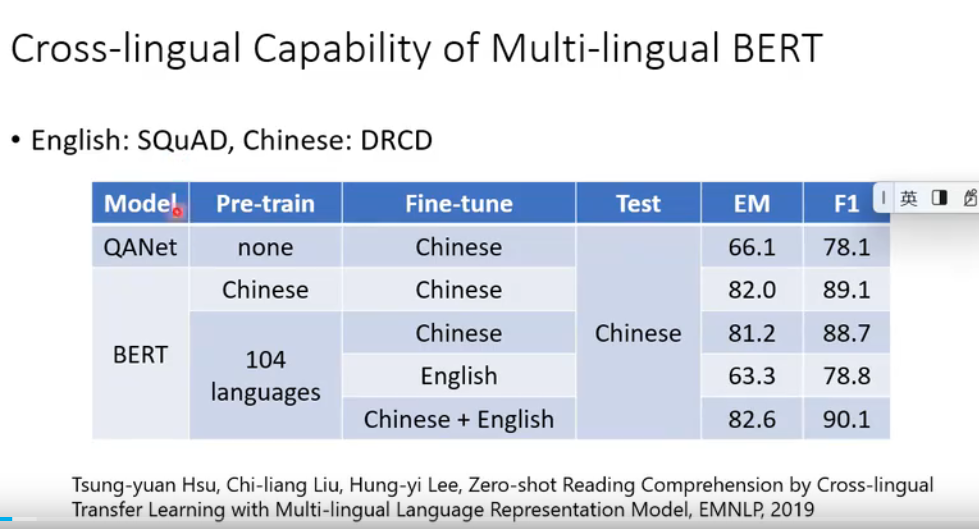

#### Xtreme 数据集
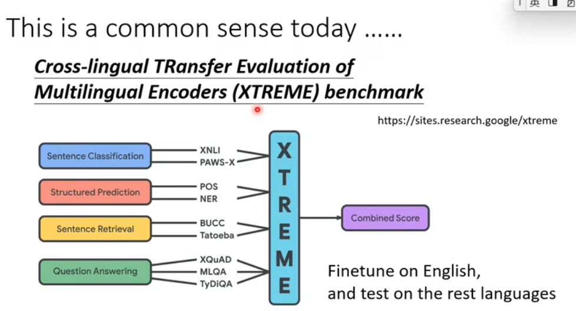

#### word embedding
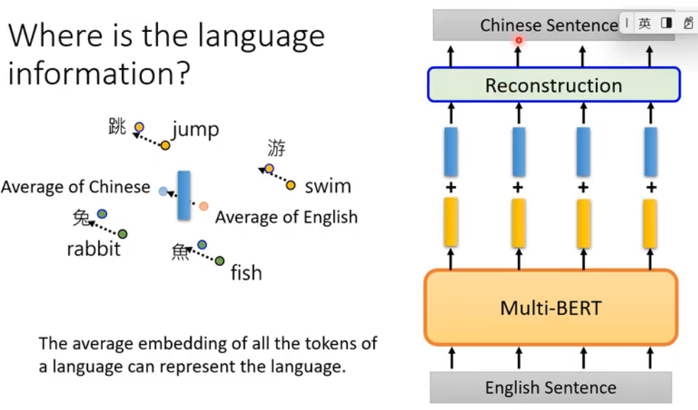

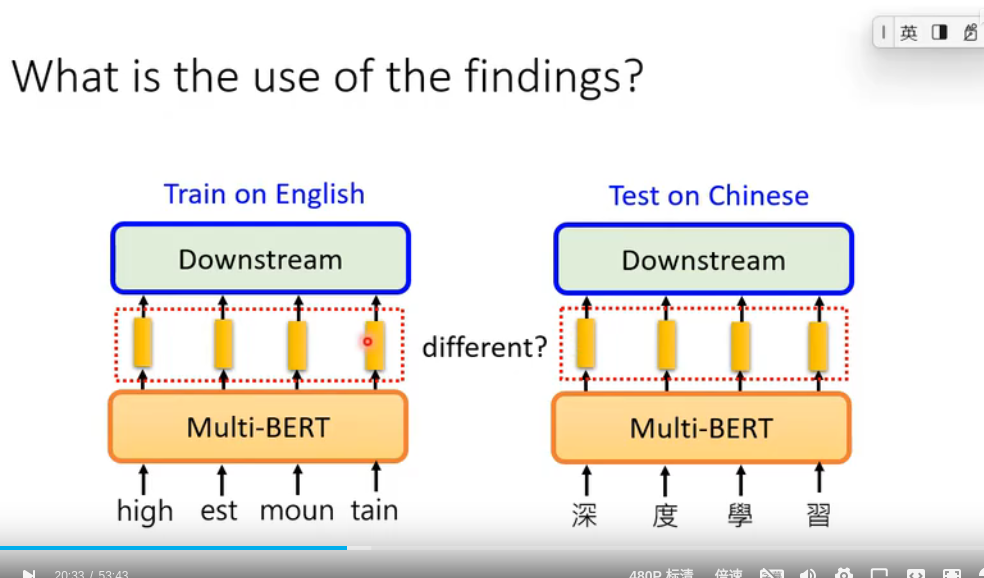

### Cross-discipline Capability 跨学科的能力
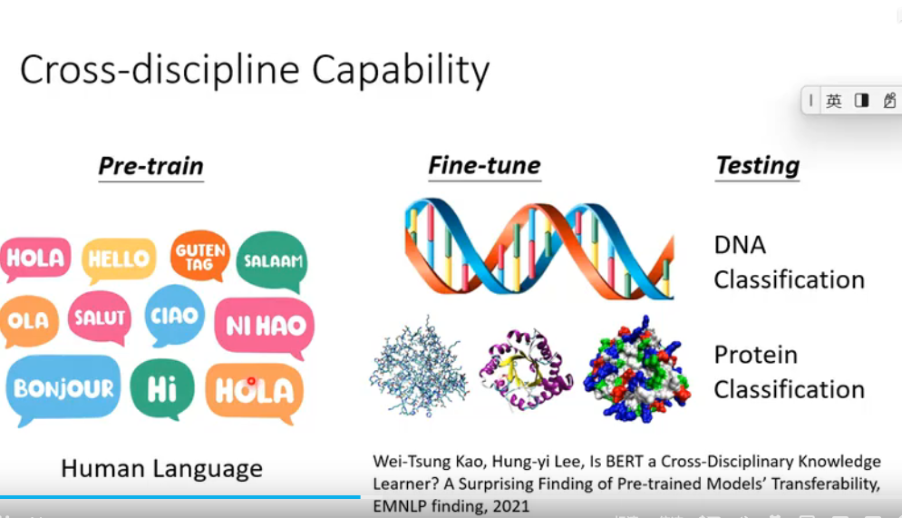
1. DNA分类
2. 蛋白质分类
3. 音乐分类

### Optimization
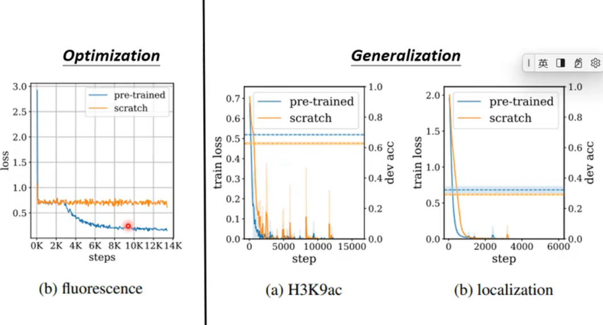

#### pre-train
#### seratch

#### 客服系统 speech Question Answering
#### SpeechBert
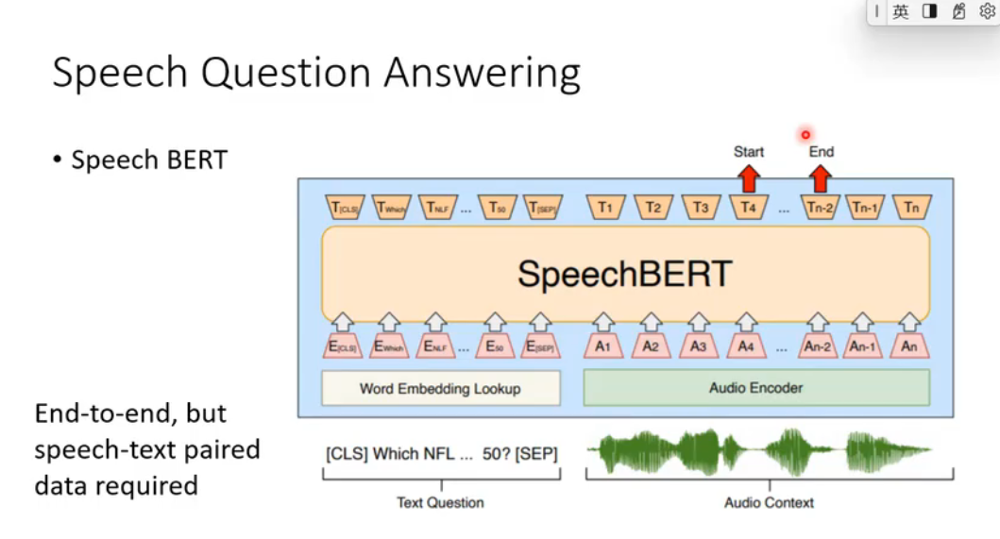

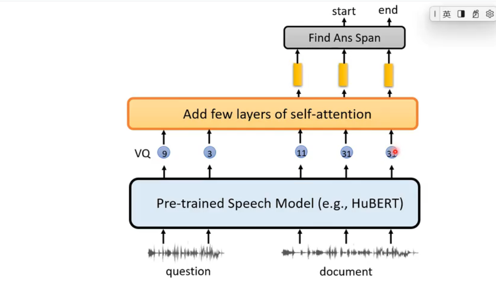

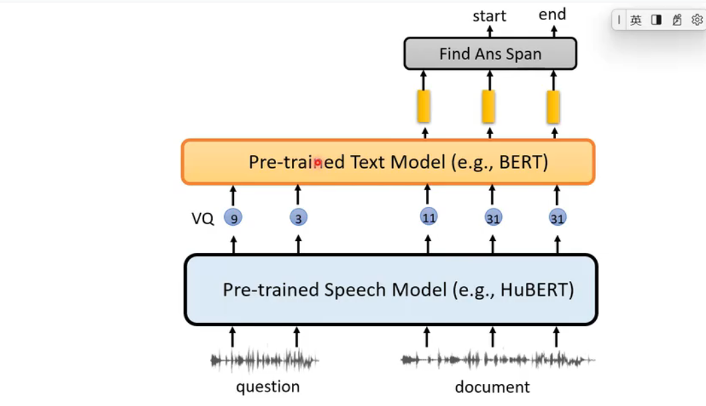

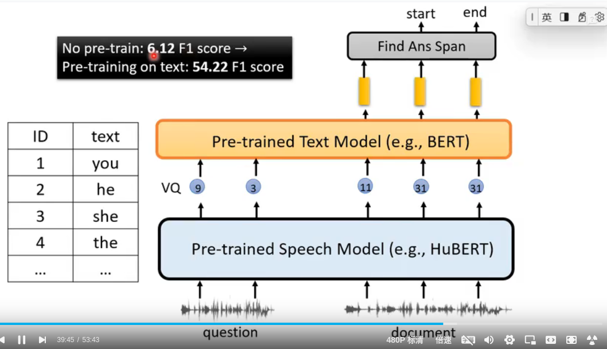

### 在人造数据集上训练
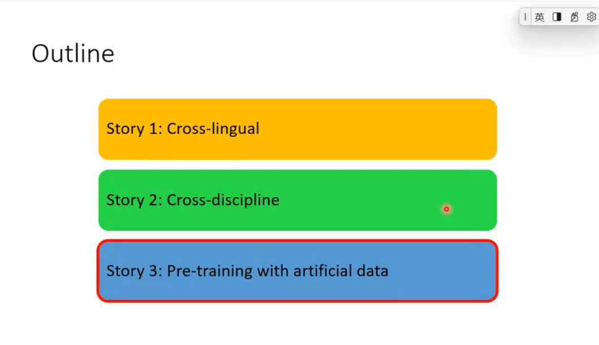
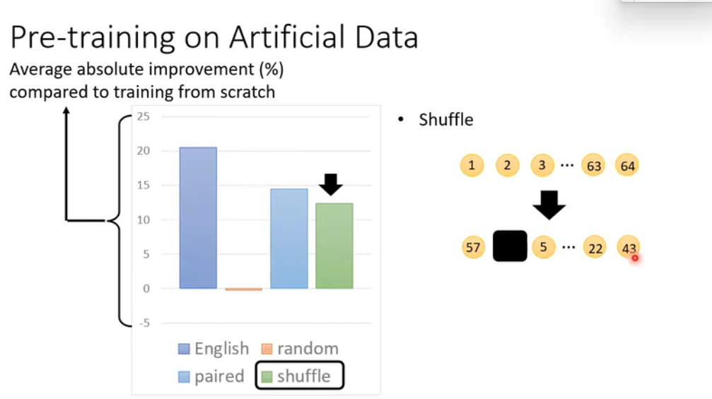

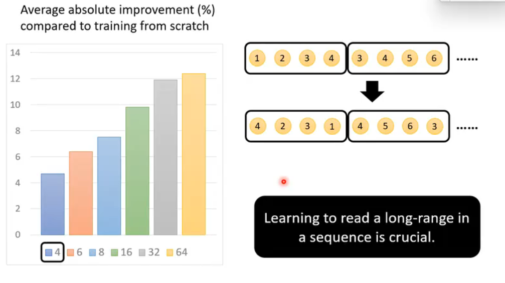

