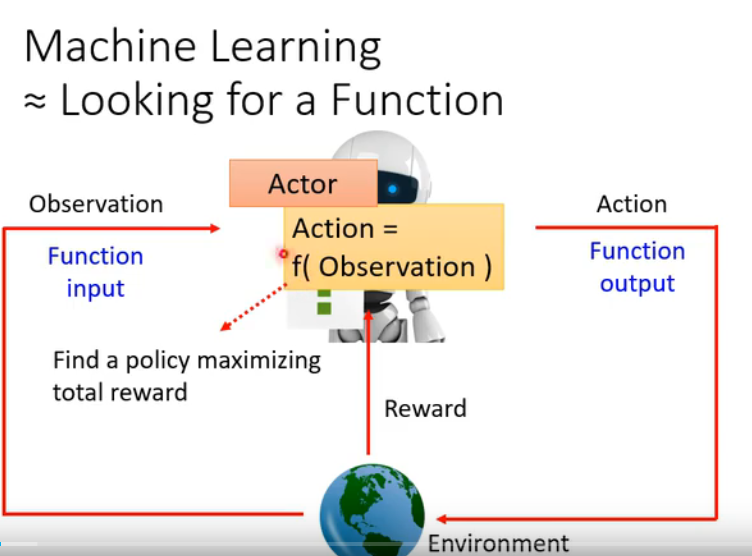
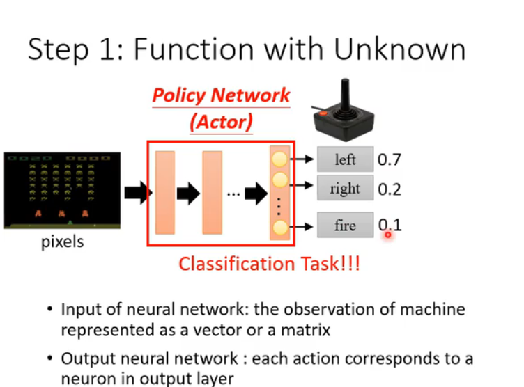
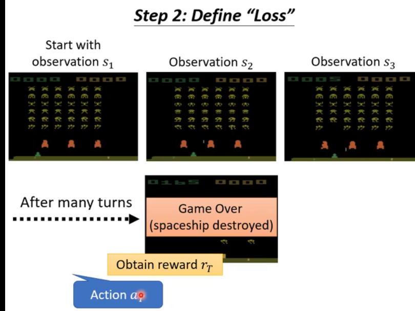
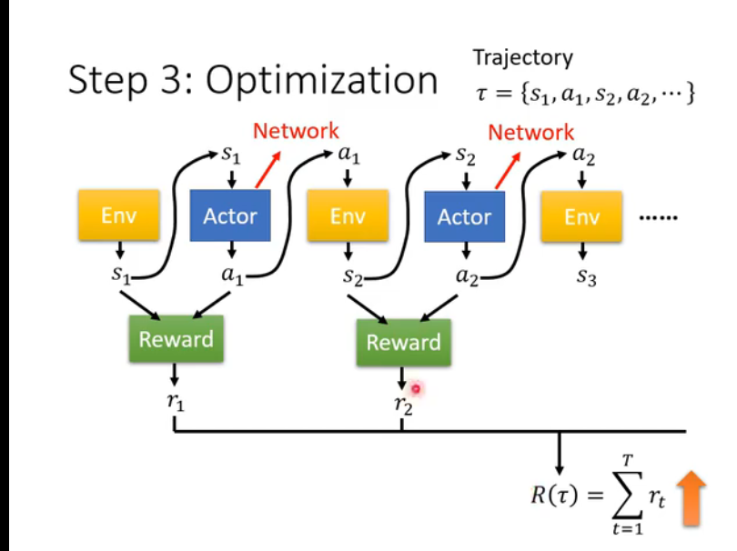
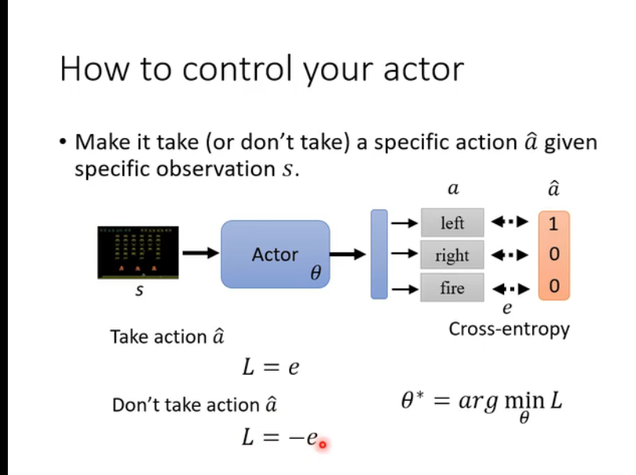
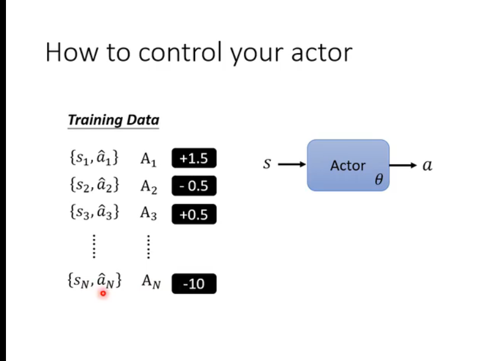
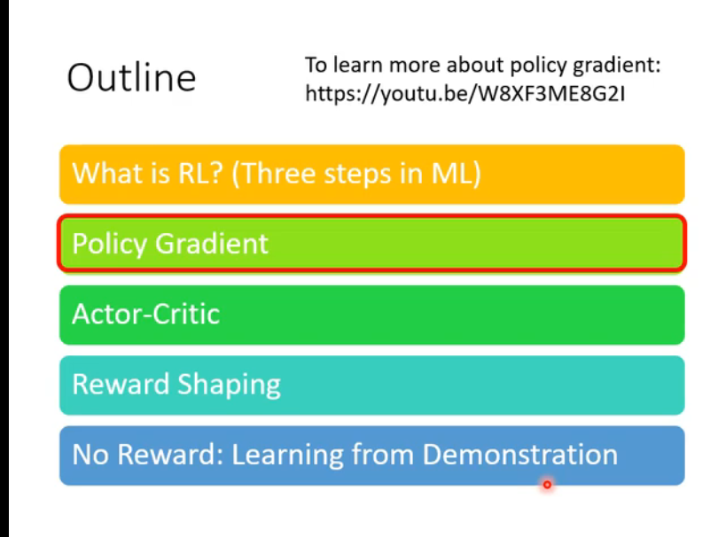

#### Supervised LEARNING -- RL

1. Action (policy network)
2. Observation 
3. Reword(Return) TotalReword==Return

#### RL 训练
1. Function with unknown
2. Define Loss
3. Optimization
Trajectory (轨迹)
ENV
Actor
Reword

#### 训练集

