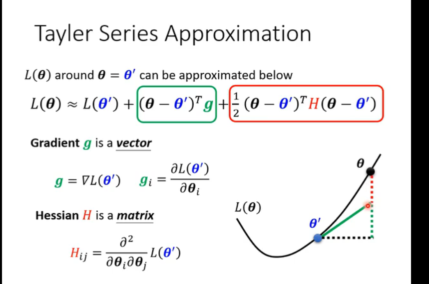
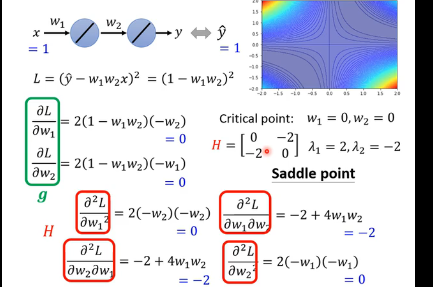

#### Loss不再下降 积分不下降  微分gradient为0,临界点 (critical point)导致loss不下降
1. local minima(局部最小值) 或者saddle point(鞍点：鞍点是指在某个方向上是局部最大值，而在另一个方向上是局部最小值的点。)
2. Tayler Series 泰乐展开 
3. 海森矩阵
4. 判断是什么导致微积分等于0导致loss函数不变的方法：

5. 特征值(eigen value)