# 有三大模型压缩的方法
1. 剪枝
2. 知识蒸馏
3. 参数量化

## Knowledge Distillation(知识蒸馏)
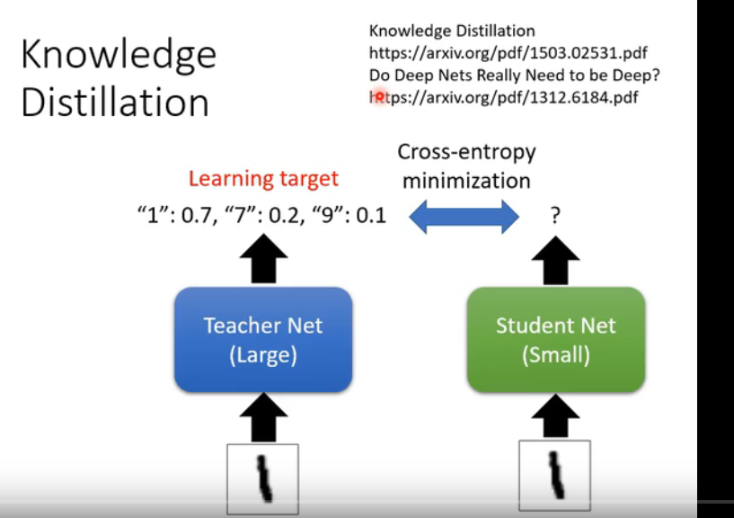

#### Ensemble集成学习
1. Bagging 装袋法
2. Boosting(提升法)
3. Stacking(迭代法)

#### Temperature for softmax
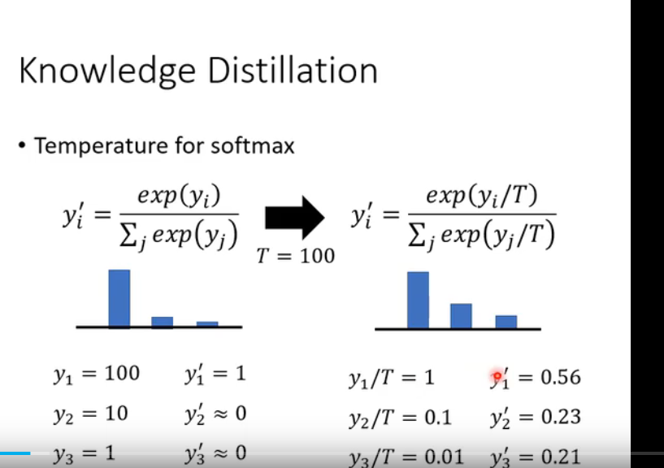

## 参数量化
1. Using less bits to represent a value
2. Weight clustering
3. Represent frequent clusters by less bits 
4. Binary Weight 二值量化
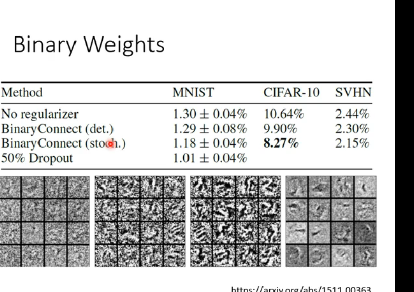

#### 回顾CNN
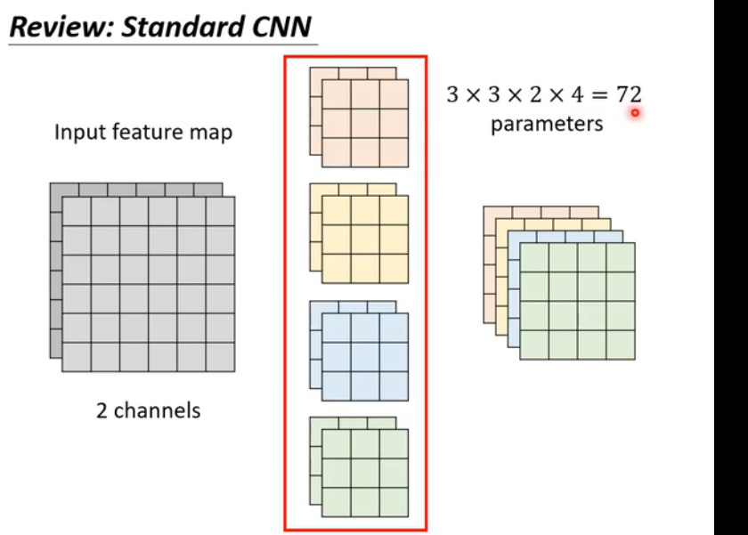

#### 深度可分分离卷积（Depthwise Separable Convolution）
1. 深度卷积 depthwise Convolution
2. 逐点卷积 pointwise Convolution

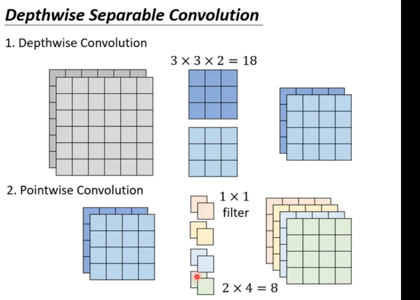
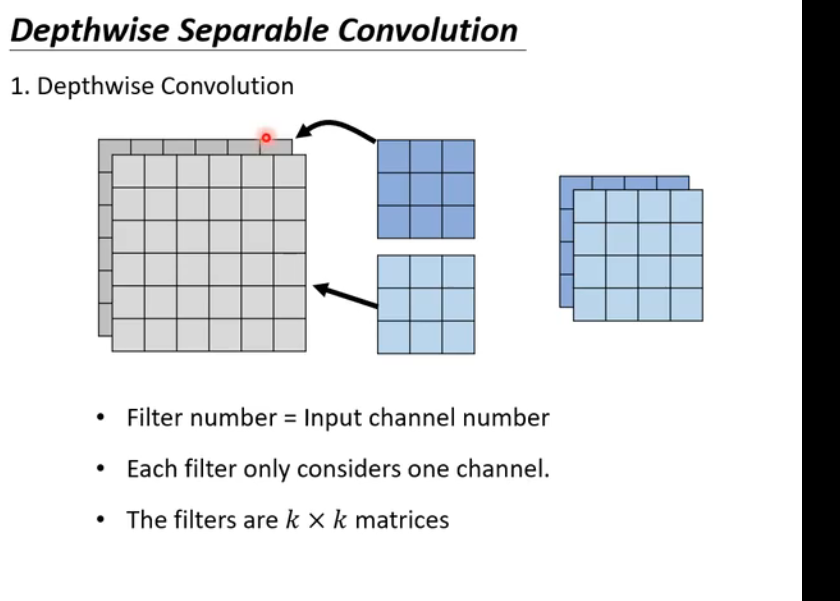

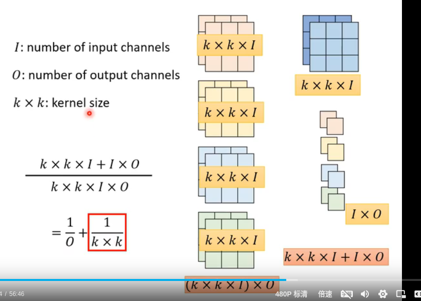

#### Low Rank approximation(低秩近似)
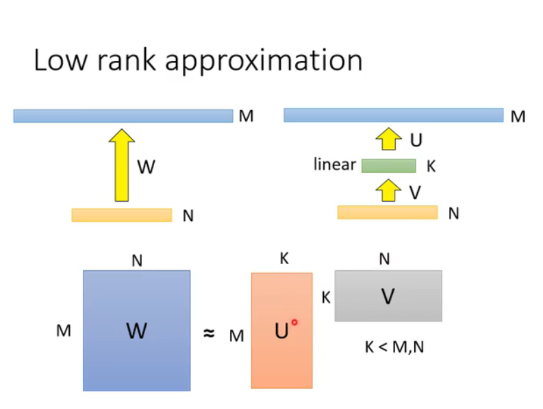
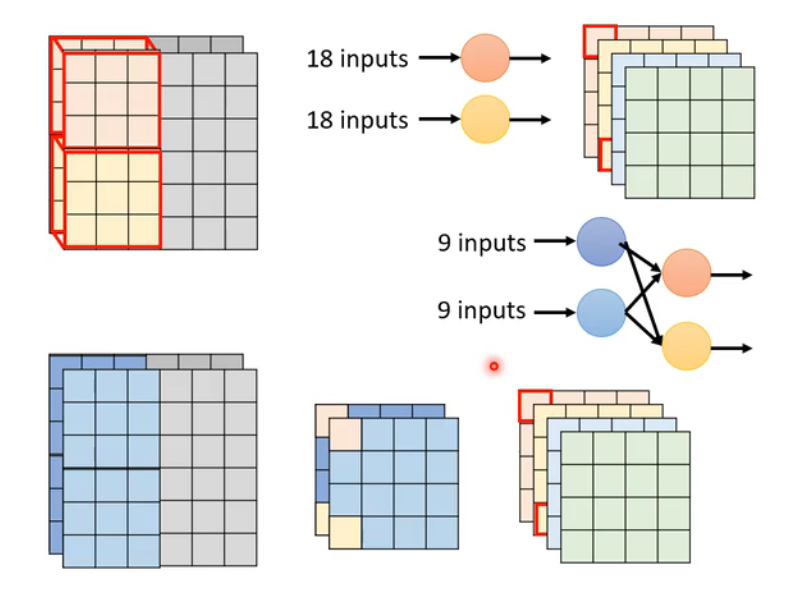
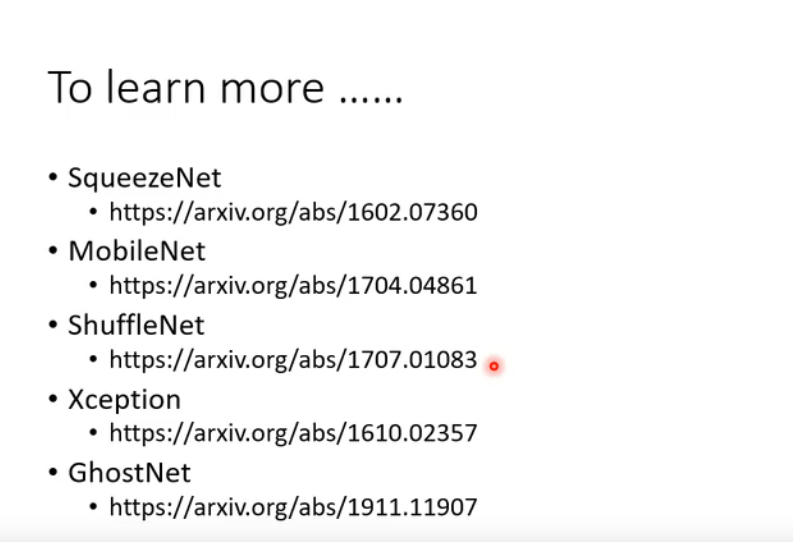

## Dynamic Computation(动态计算)
1. The network adjusts the computation it needed
2. Dynamic Depth 动态调整深度
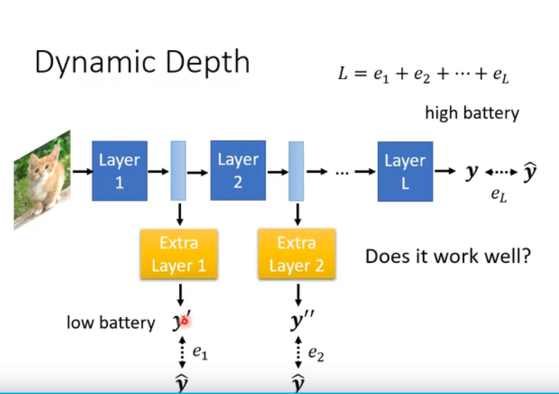
3. Dynamic Width 动态调整宽度
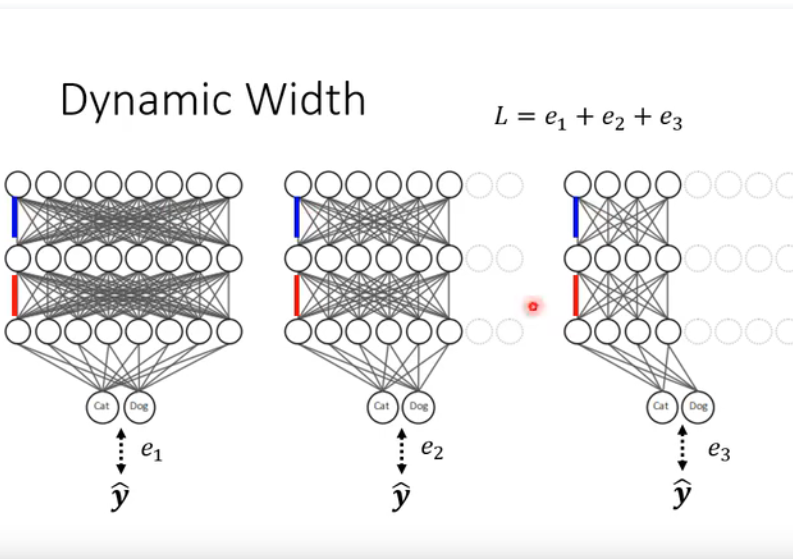
4. 基于样本难度的计算(Computation based on Sample Difficulty)
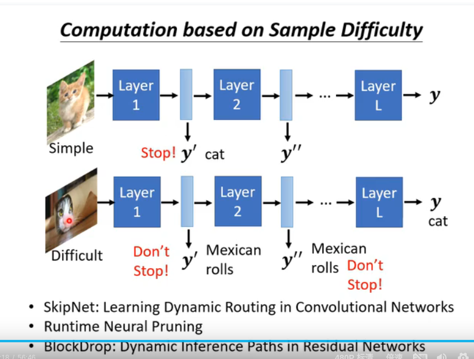

### 总结
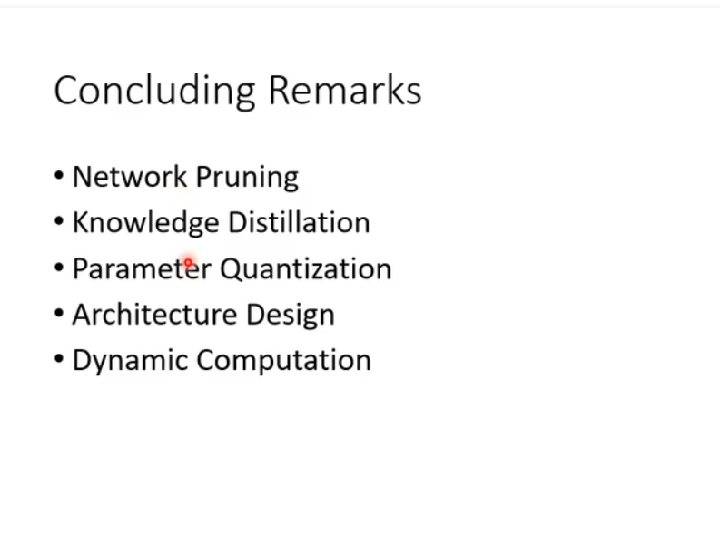

