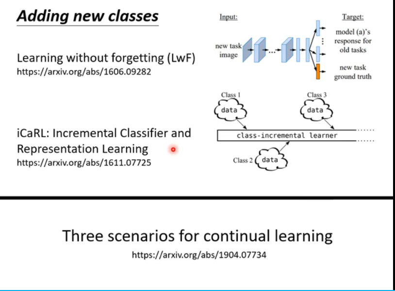

### Life Long Learning(LLL)

### bAbi数据集

### Catastrophic Forgetting(灾难性遗忘)
### Multi-task training can solve the problem

### Evaluation评估

### Research Directions研究方向

#### 发生灾难性遗忘的原因

#### 选择性突触可塑性 Selective Synaptic Plasticity

#### 梯度情景记忆Gradient Episodic Memory(GEM)

#### Progressive Neural Networks 渐进式神经网络

#### PackNet

### Memory 
#### Generating Data

#### 任务顺序（Curriculum Learning）

