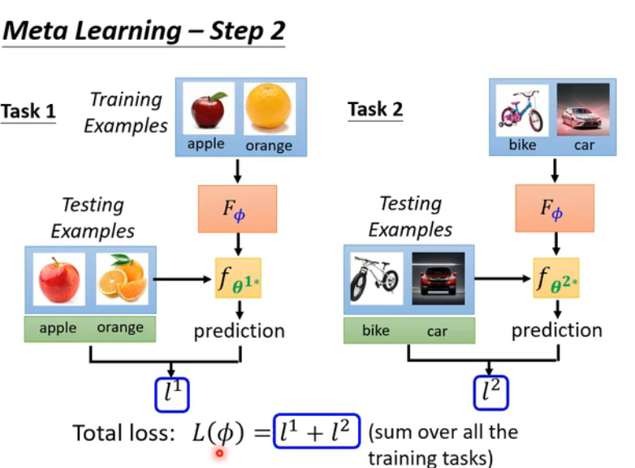
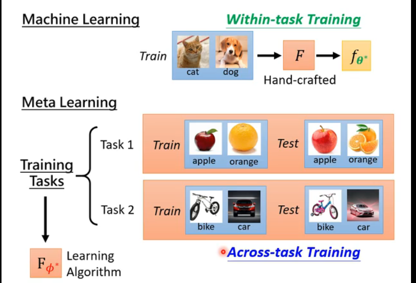
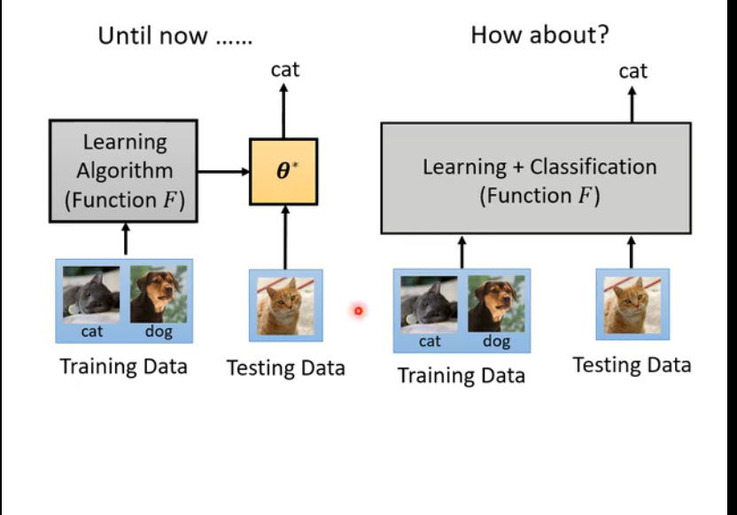
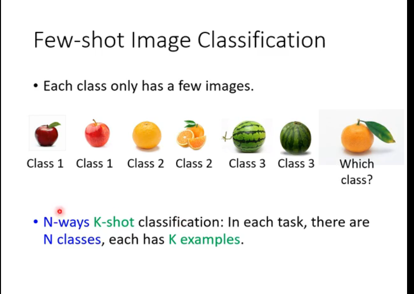

### hyperparameters超级参数

### 元学习

#### learnable

#### loss function

##### 小样本学习

### 机器学习ML和元学习的区别(meta learning)

#### 可训练的(初始化)

##### Model-Agnostic Meta-Learning
##### Reptile

##### MAML v.s. pre-training

##### MAML为什么生效

##### 可训练的Optimizer()

#### 可训练的 Network Architecture Search(NAS)

####  
#### 可训练的(Beyond Gradient Descent)

#### Few-shot Image Classification(N-ways K-shot)

#### 元学习应用: Omniglot

#### 应用

#### Meta Learning vs. Self-supervised Learning

#### Meta Learning and BERT

#### Meta Learning and Knowledge Distillation   

