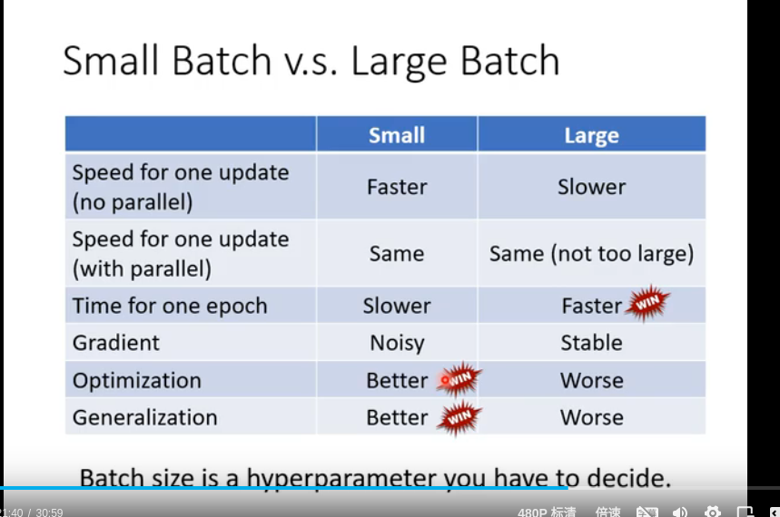
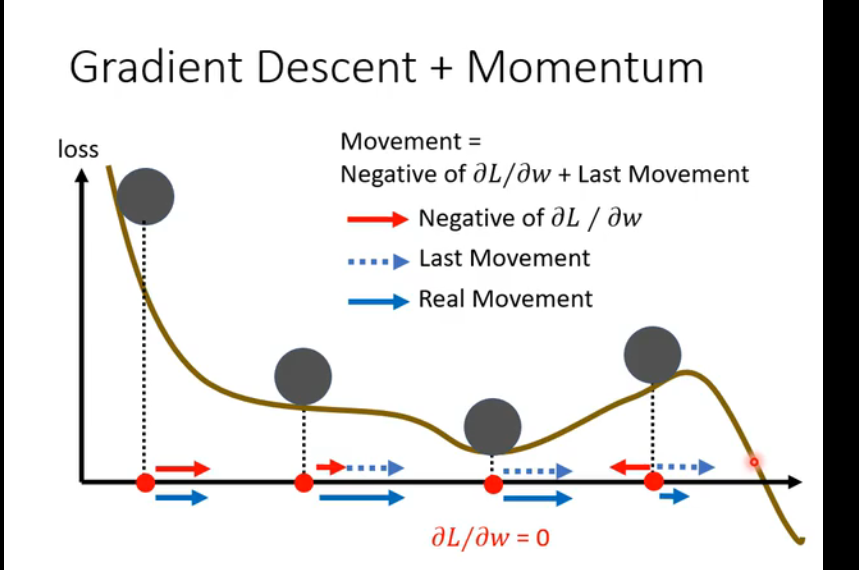

1. epoch ---> 洗牌
2. batch 为什么要batch
3. 每一个epoch，大batch
4. small noisy

5. Momentum
   Momentum‌是一种优化算法，主要用于加速梯度下降过程，特别是在处理高曲率和噪声梯度时表现优异。它通过累积之前梯度的指数衰减平均来影响当前梯度的更新，从而帮助模型更快地收敛并减少震荡‌
   1
   2
   。

Momentum的基本原理
Momentum的灵感来源于物理学中的动量概念，即物体在运动过程中具有惯性，会继续沿着当前方向前进，除非受到外力作用。在机器学习中，Momentum通过累积之前梯度的方向来加速当前的梯度下降过程，使得优化过程更加稳定，并且有助于跳出局部极小值‌
2
。

Momentum的作用和效果
‌加速下降‌：在梯度一致的方向上，Momentum能够加速下降，提高收敛速度‌
2
。
‌降低震荡‌：在高噪声或曲率大的方向上（如鞍点附近），Momentum可以降低震荡，提高优化稳定性‌
2
。
‌跨越局部极小值‌：由于Momentum累积了之前的梯度信息，在遇到局部极小值时仍然可能继续前进，从而避免陷入局部极小值‌
2
。
Momentum的数学表达式和实现方式
Momentum的核心思想是通过累积之前梯度的指数加权移动平均来影响当前参数的更新。具体公式如下：
[ v_t = \mu v_{t-1} - \epsilon \nabla g(\theta_{t-1}) ]
[ \theta_t = \theta_{t-1} + v_t ]
其中，( v_t ) 是动量项，( \mu ) 是动量系数（通常取0.9），( \epsilon ) 是学习率，( \nabla g(\theta_{t-1}) ) 是当前梯度‌
2
。

Momentum的变种
除了标准的Momentum，还有一种改进的变种叫做 ‌Nesterov Momentum‌。Nesterov Momentum在计算梯度时考虑了下一步的位置，使得优化过程更加高效‌
2 。

