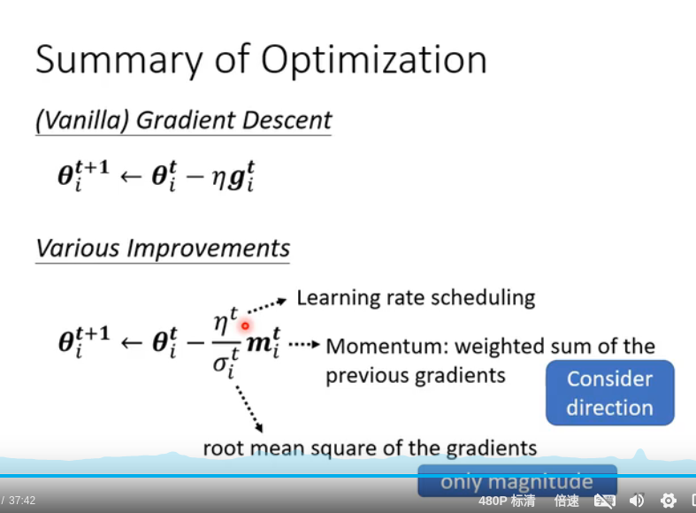

‌Warm up‌是深度学习训练中的一种技术，旨在改善训练的稳定性，特别是在训练的初期阶段。其主要目的是在训练初期逐步增加学习率，避免直接使用高学习率导致参数震荡，从而影响模型的收敛速度和最终性能。

Warm up的作用和重要性
‌避免参数震荡‌：在训练初期，如果直接使用较高的学习率，可能会导致参数剧烈震荡，影响模型的收敛。通过warm up，可以逐步增加学习率，减少这种震荡。
‌提高训练稳定性‌：Warm up有助于模型在训练初期更快地进入稳定状态，减少因学习率设置不当导致的训练不稳定问题。
‌优化模型性能‌：通过合理的warm up策略，可以提高模型的收敛速度和最终性能。
Warm up的实现方式
Warm up通常通过在训练初期逐步增加学习率来实现。一种常见的方法是在训练初期使用较小的学习率，经过一定步数后逐渐增加到初始设定的学习率，然后再按照预定的学习率调度策略进行训练。例如，可以先用较小的学习率训练一定的步数（如400步），然后再将学习率增加到初始值继续训练‌
1
2
。

Warm up在不同模型中的应用实例
Warm up技术在大型模型（如Resnet等）的训练中尤为常见。例如，Resnet在层数增加后，使用warm up可以有效避免因学习率过大导致的训练不稳定问题。具体做法是先用较小的学习率（如0.01）训练一段时间，然后再将学习率增加到初始值（如0.1）继续训练‌
1
。

