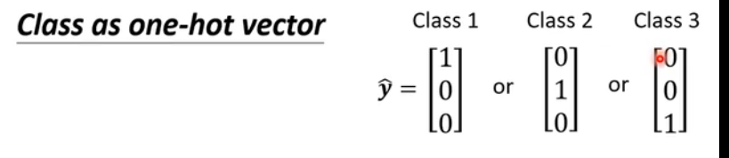
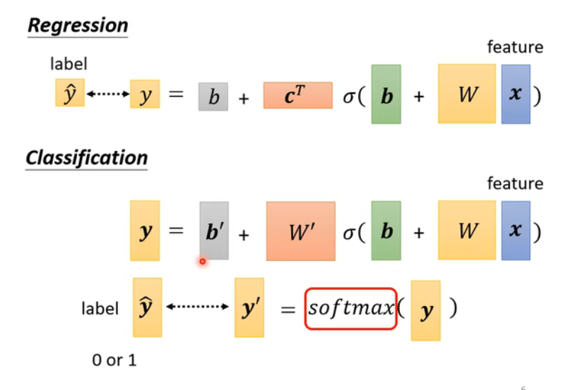
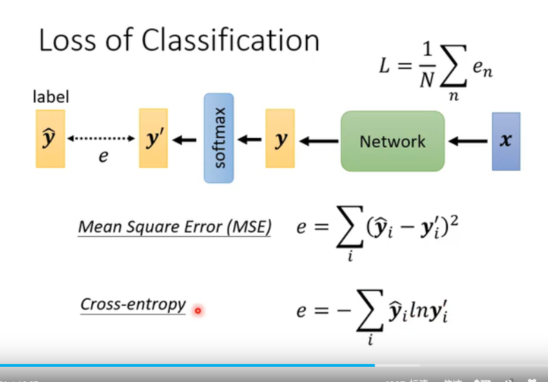

####  regression(回归)  classification(分类)

#### 分类方法: 
1. 数字映射
2. 向量映射 class as one-hot vector
3. 分类

    

   
 

softmax
sigmoid

#### loss function 损失函数 

Mean square Error(MSE)求差的平方和(均方误差)

cross-entropy交叉熵(交叉熵)(likelihood 可能性) 

[交叉熵和均方误差](https://blog.csdn.net/wuzhongqiang/article/details/115603924)

