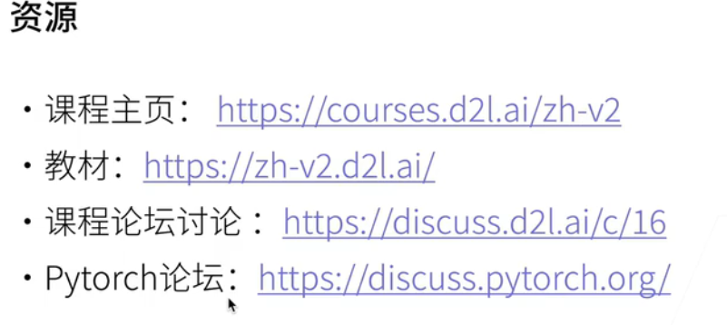
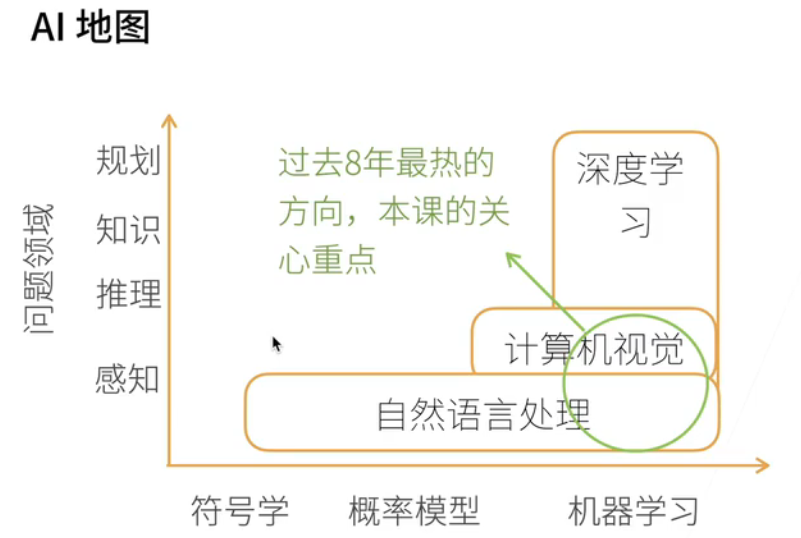
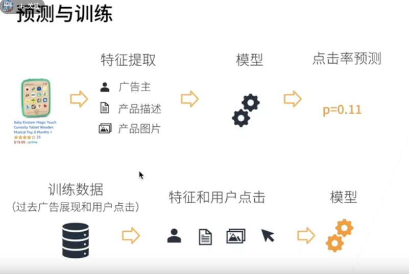
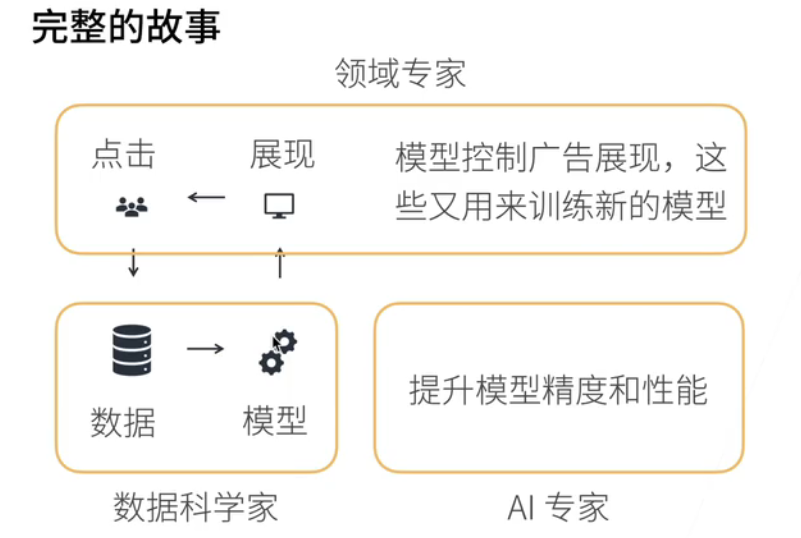
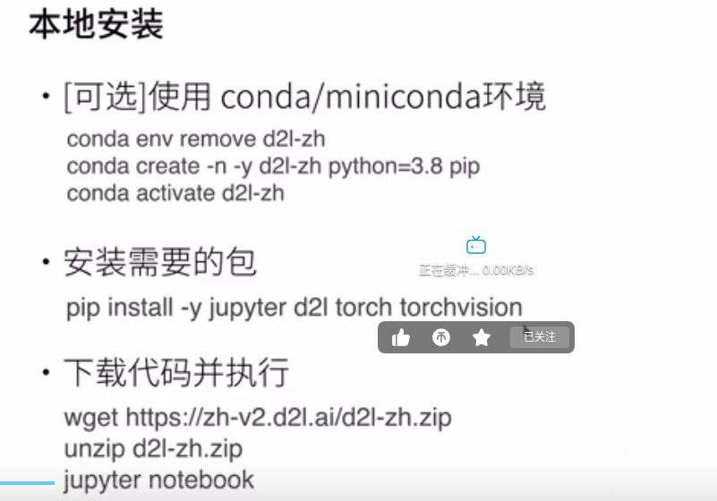
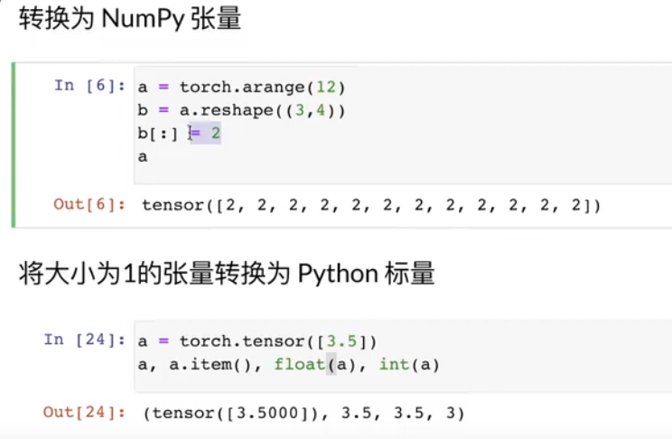

https://courses.d2l.ai/zh-v2
https://zh-v2.d2l.ai/



####  应用场景
1. 样式迁移
2. 人脸合成
3. 文生图
4. 文生文
5. 无人驾驶
#### 广告点击
1. 触发 概率 (训练)
2. 点击率预估 
3. 排序 （点击率 x 竞价）
4. 预测 训练



```shell
d2l torch jupyter
```


```shell
jupter notebook
```
https://space.bilibili.com/1567748478/lists?cid=175509


