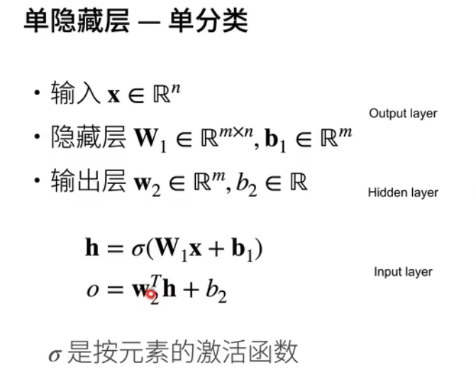

### 学习XOR


### 单隐藏层



### 为什么需要非线性激活函数

### 激活函数 sigmoid


### Tanh激活函数


### ReLU激活函数


### 多类分类
```shell
y1,y2,y3,....,yk = softmax(o1,o2,3,...,ok)
```


### 多隐藏层


```
pip install autogluon
pip install kaggle
kaggle c download titanic
unzip -o titanic
```


### 代码
https://github.com/awslabs/autogluon
### 文档
https://auto.gluon.ai