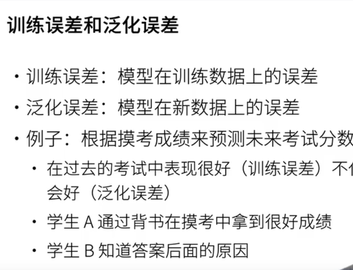
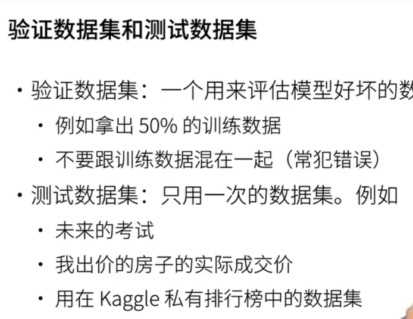
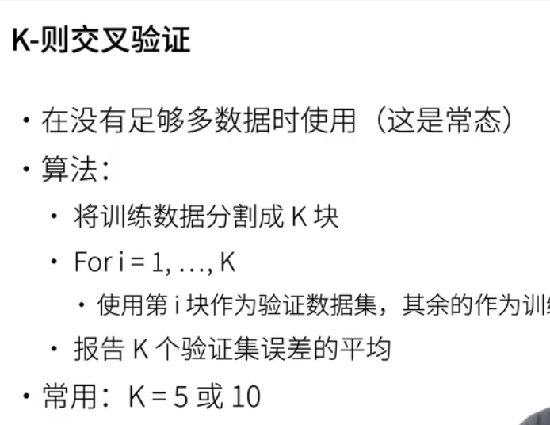
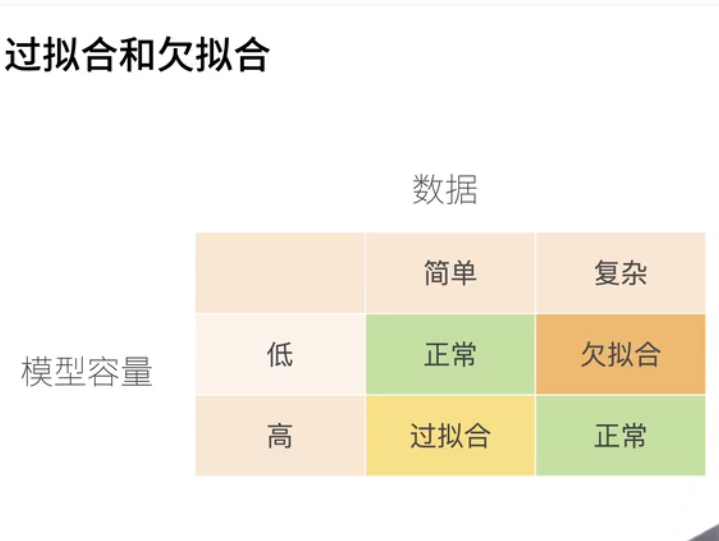
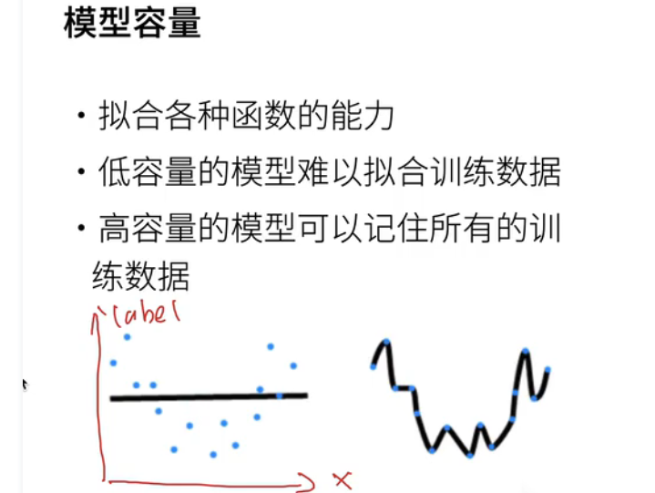
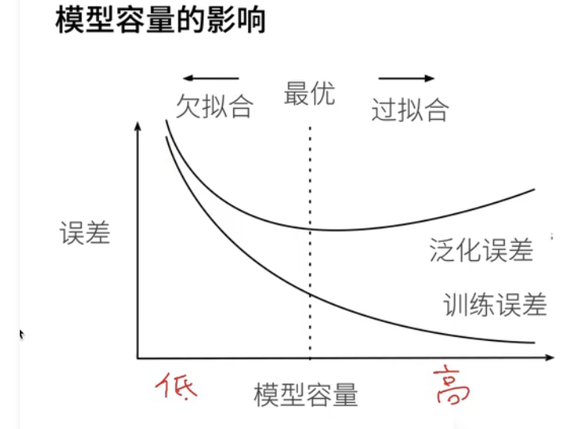
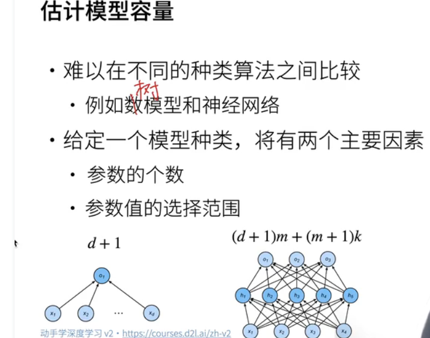
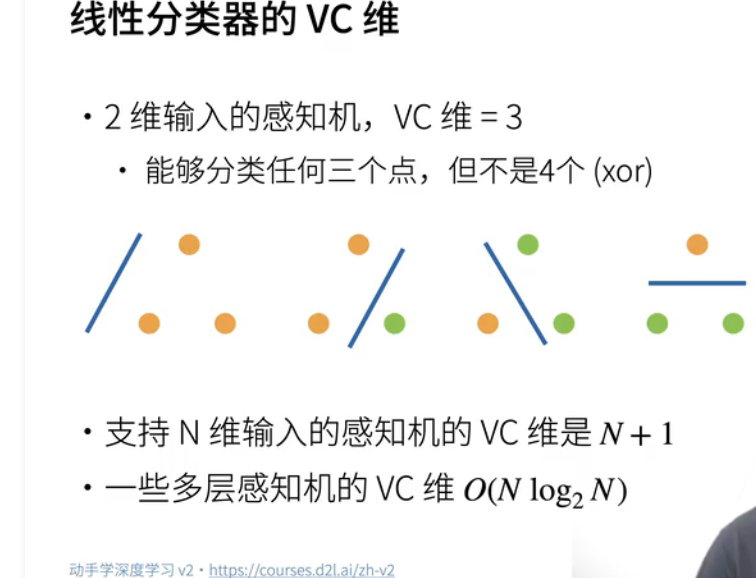
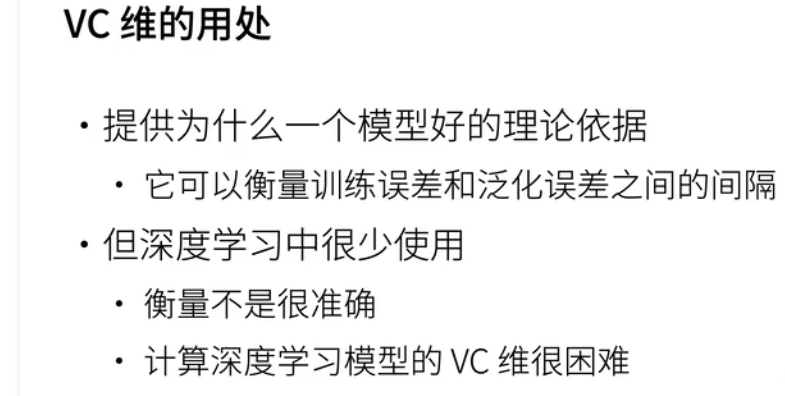
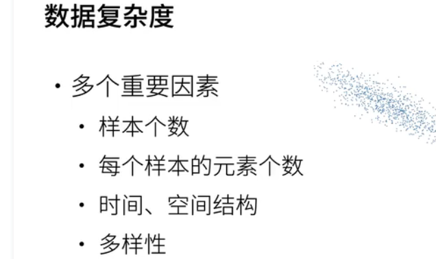

### 训练误差和泛化误差

### 验证数据集 测试数据集

1. 验证数据集: 一个用来评估模型好坏的数据集 (不要跟训练数据集混合在一起)
2. 测试数据集： 只用一次的数据集: 未来的考试，我出价的房子的实际成交价；用在Kaggle私有排行榜中的数据集

### K-则交叉验证
* 在没有足够多的数据时使用
* 算法 
* 讲数据集分割成K块 抽出一份作为验证数据集，训练K次，然后取k次验证的平均值误差验证数据集验证结果

### 过拟合和欠拟合
#### 模型容量 数据集
1. 模型容量
2. 数据集

####  模型容量

####  模型容量的影响

#### 估计模型容量

#### VC维 线性
1. 线性分类器的VC维

2. VC 维的用处

#### 数据的复查度
##### 多个重要因素
1. 样本个数
2. 每个样本的元素个数
3. 时间和空间结构
4. 多样性
