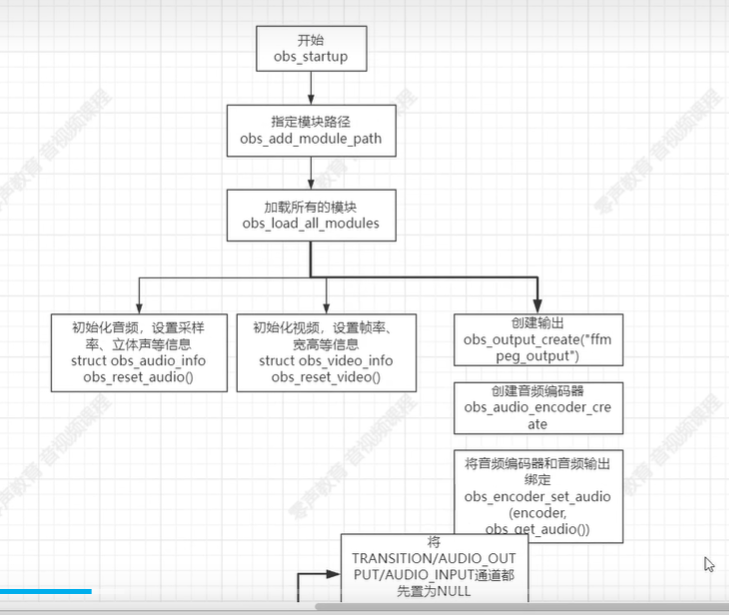
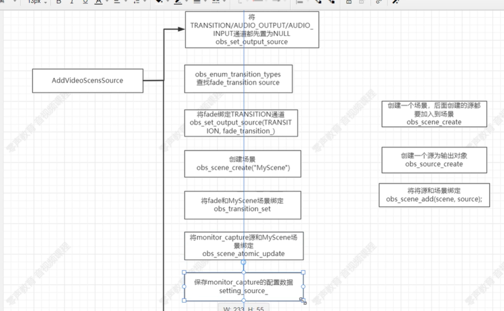
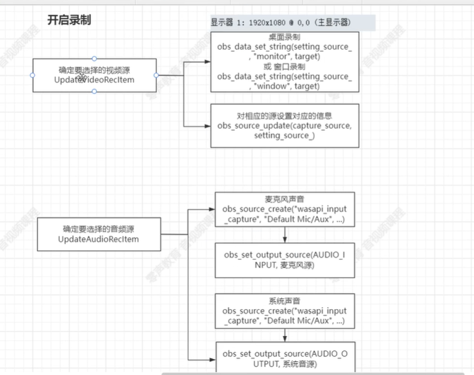
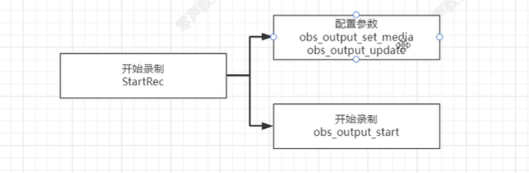
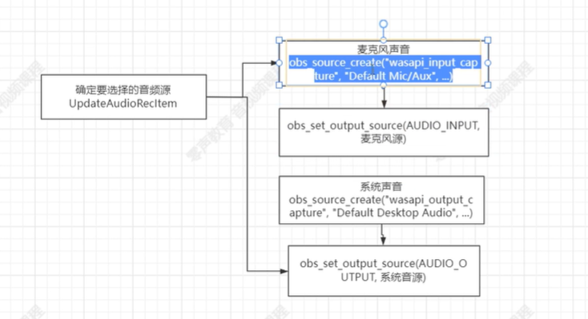
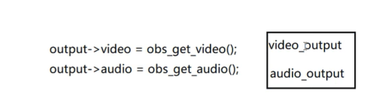
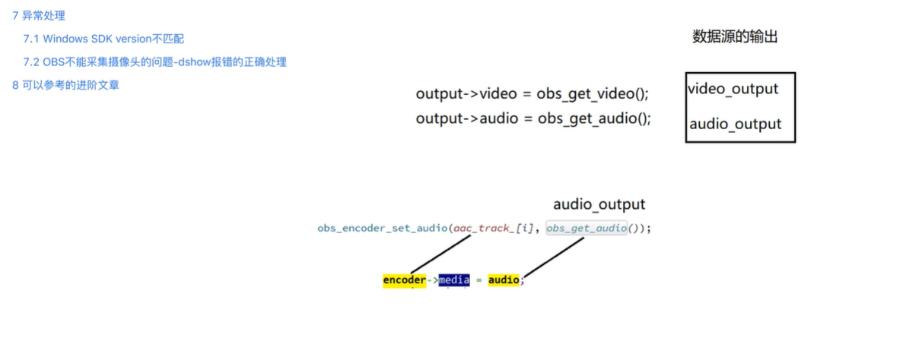
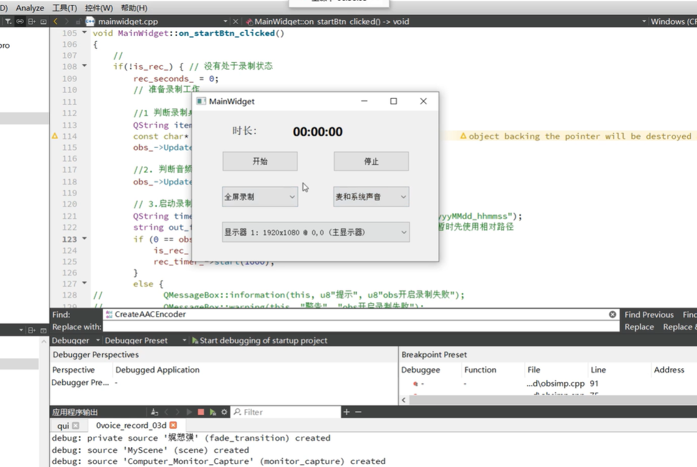
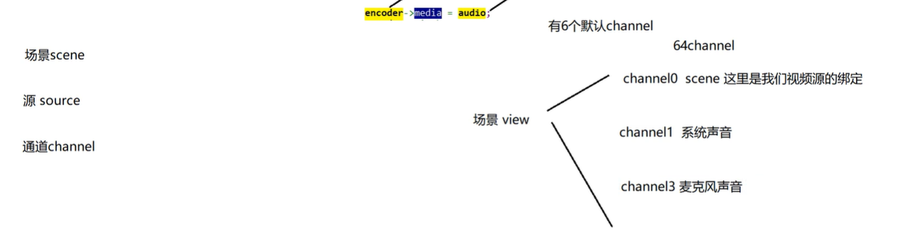
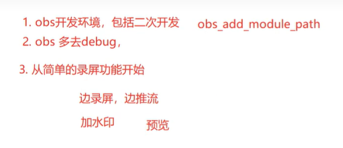

#### OBS 

##### 数据源的输出 

#### 场景 源  通道
1. 有6个默认的channel 
2. channel0 scene 视频源的绑定
3. channel1 系统声音
4. channel3 麦克风声音

5. 

##### obs学习路径
1. 开发环境 
2. 二次开发
3. 从简单的录屏功能开始
4. 变录屏边推流
5. 加水印 预览功能
