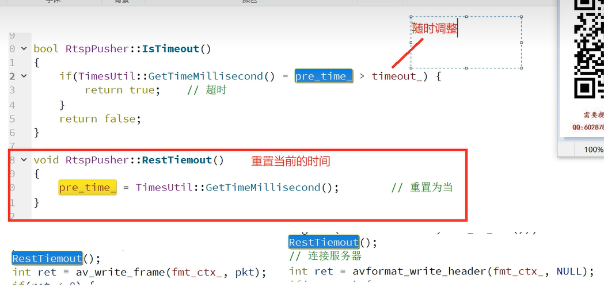

#### 坑
1. 推流架构分析
2. 推流缓存队列的设计
3. ffmpeg函数阻塞问题


### 
1. 本地文件需要做音视频同步
2. 直播实时平台实时流也需要音视频同步？ 网络问题(网络抖动 30-50ms很正常) 丢包 网络比较差 网络带宽问题
2.1 音频一帧大概23ms左右
2.2 客户端要同步 但是需要缓存
2.3 视频采集： 0ms 40ms 80ms 120ms --->网络发送--->接收端: 0ms 40ms
2.4 TCP/IP 头部
2.5 要先缓存 缓存100 -200ms 数据再开始播放
2.6 一接上客户端 收到2秒的数据，一直按正常速率播放，延迟2秒；变速播放比如1.5倍，等缓存比如到500ms再正常播放

2.7 UDP: 音视频通话 主播连麦
    TCP: 主播直播的时候


音频44.1HZ
1024个采用点为一帧


```shell
1024个LR
-------            ----- LLLL...LL RRRR...RRRR
LRLRLRLR....LRLRLR
```


ffmpeg自带的aac的需要fltp
fdk-aac需要s16


#### 能不能直接发送不放入队列
1. 网络编码的时候如果不放入队列,导致编码也阻塞

#### 缓存队列如何设计
1. 能统计队列里面，音频和视频可以播放多长
2. 方便优化整个传输链路，比如降低码率
3. 线程安全
4. 阻塞唤醒机制
5. drop帧功能


#### 能统计队列里面，音频和视频可以播放多长
1. 按照帧持续时间叠加 1024/48000=21.3ms * 20帧 = 426ms
视频 25fps帧率  40ms*20帧=800ms
2. 按照pts


#### drop帧功能

I PP......P I....PPP
front               back


