### SRS nginx-rtmp zlmediakit jitisi licode
学霸君 


### janus-gateway 搭建
```shell
janus --debug-level=6
```

### webRTC -janus(C语言写的)
1. web js
2. Android java
3. Windows c++
4. 静音
5. 带宽投入 人 声网 即构科技 

### 公司
1. 京东 拼多多 淘宝 直播卖货
2. 疫情 线上教育

1080p 一分钟7毛钱 如果有10个人 一分钟就是7元钱

只要是基于浏览器的音视频通话，绝对是通过webRTC做


### 信令
SDP 媒体协商

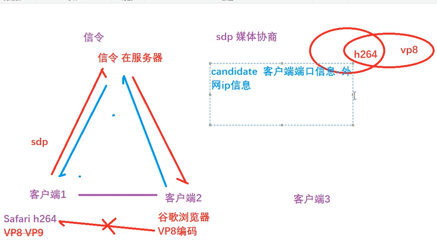

sdp candidate
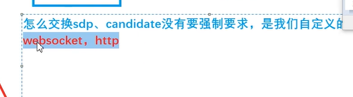
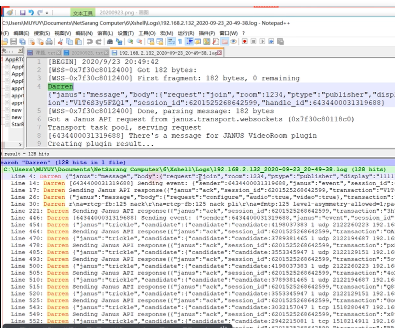
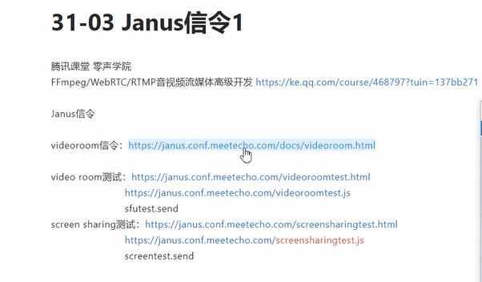

插件: videoroom videocall
核心: janus

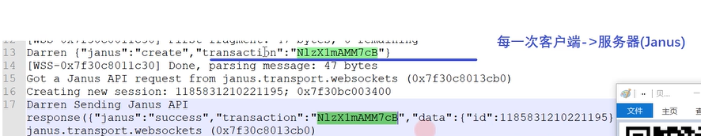
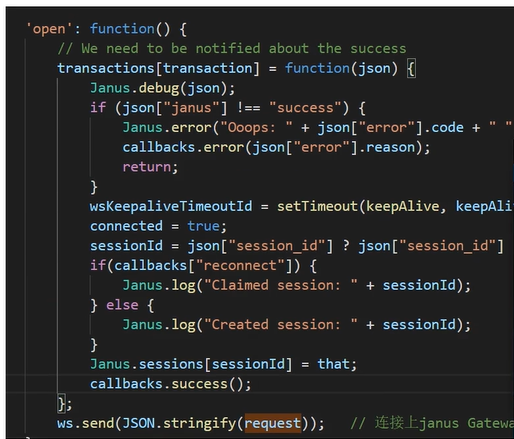

createSession 创建一个会话 


有多少个连接(RTCPeerConnection) 就有多少个transaction janus.attach

  发布(publisher)---SFU模型<---- join publisher
                   join subscriber
  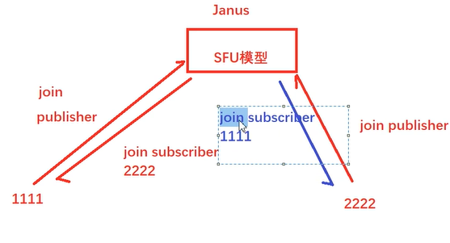
  
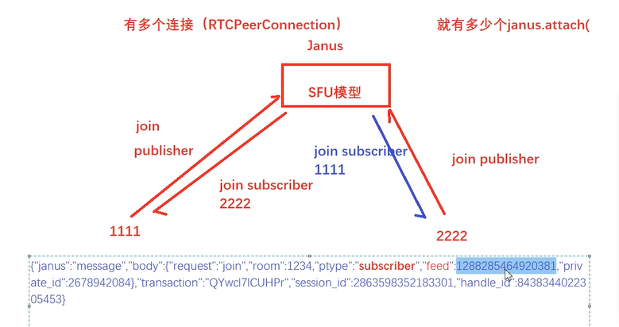
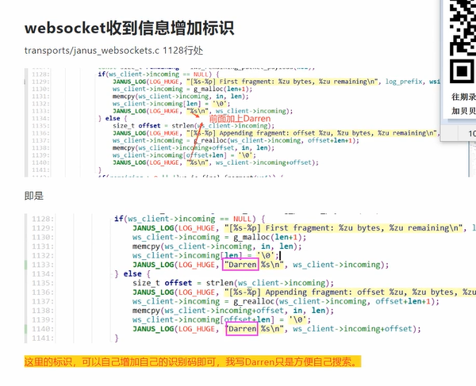
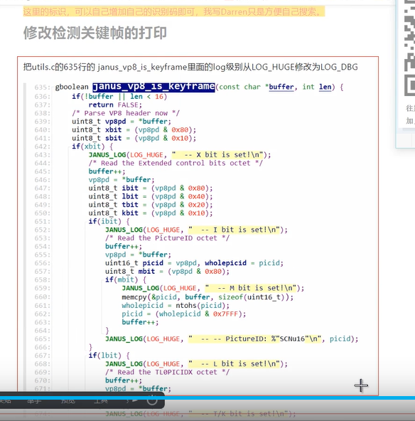
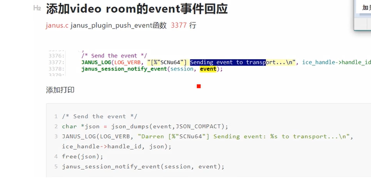


zeromq