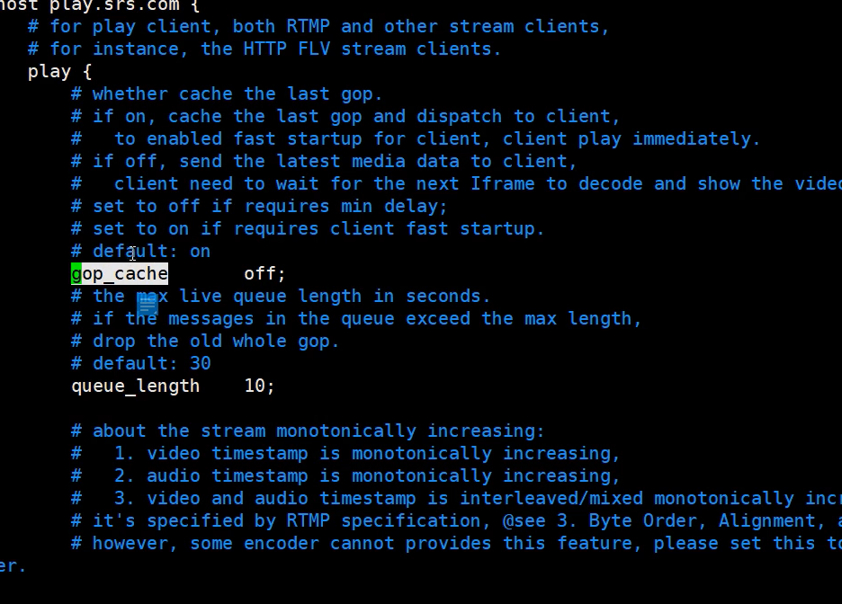

#### SRS学习方式
1. 搭建服务跑起来
2. 从整体功能架构上去分析，高层建房
3. 分析源码，调试跑起来，比如直接使用gbd 也可以使用vscode
4. 二次开发

5. fastdfs zeromq mongodb

#### 万人直播架构
1. Forward模式

2. 边缘模式edge

3. 二次开发srs的时候，对于srs edge的回源机制要加自己的调度策略
4. 经过多级CDN延迟大概率是网络延迟导致的

#### SRS
##### srs是协程的架构 不是多线程，也不是多进程
1. 协程-连接: 1:1对应关系 : 一个客户端连接到服务器，服务器要创建一个协程
和连接对应

一种情况: 读和写都在同一个协程
另一种情况是: 读一个协程 写一个协程 class SrsConnection

2. 配置文件
完成配置文件: full.conf

3. 网络不好的时候 服务器需要缓存 queue_length

4. 推流 拉流 流媒体服务器转发流
  srs listen ---> accept--->do
  断点: b accept
  disable 

推流: source---> consumer(独立的queue)(对数据的维护)

ffmpeg srs webRTC
