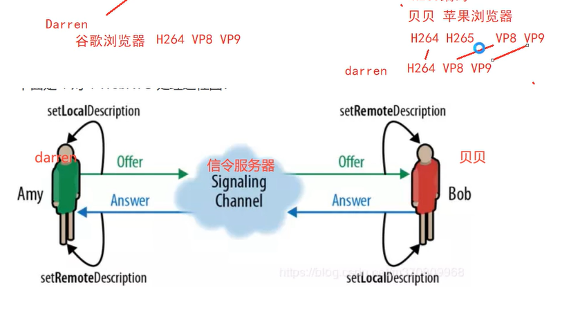
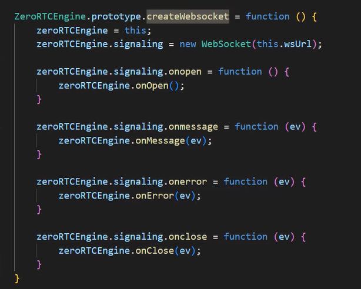

### webRTC通话 原理

#### 会议ID(房间号 频道)
1. 如何发现 信令服务器 信令通道

2. 如何发现（加入 离开 通知）
3. 音视频编解码能力沟通
浏览器: 
苹果浏览器
微软浏览器
谷歌浏览器

通过信令服务器协商 音视频编解码能力沟通

发起人(offer)： 
Answer

#### SDP(Session Description Protocol)媒体协商

#### 网络传输
NAT(Net Address Transport)

1. 为什么需要NAT 
  公网IP是有限的，如果没有NAT机制 就需要100个公网IP
  网络攻击 如果是独立的公网IP 公司的网络比较容易被攻击
2. 不同的网络，音视频数据如何转发
  两个外网IP如何互通

#### 总结 信令服务器
1. 连接管理，客户端都需要连接到信令服务器
2. 房间管理,join(需要彼此通话，加入同样的房间) notify(其他人进房间 离开房间)  leave
3. 相互转发 SDP(封装了编码信息,实际上还有其他的信息),有offer answer
4. 相互转发candidate(封装了自己的网络信息)
5. 心跳包(用于信令机制的完善)
6. .....其他的一些完善工作
#### Candidate(封装了网络信息
)

#### 检测浏览器是否支持webRTC
https://web.sdk.qcloud.com/trtc/webrtc/demo/detect/index.html

#### turn/stun的服务是独立的

## 代码解读

客户端代码

RTCPeerConnection

