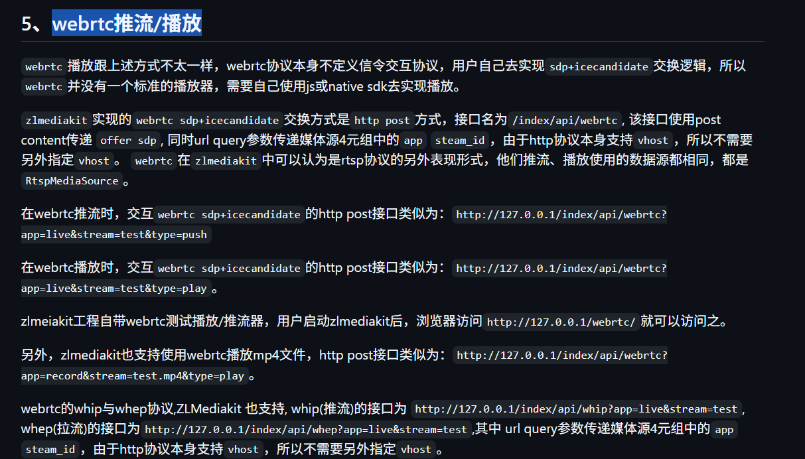

```shell
docker run -id -p 1935:1935 -p 8080:80 -v /home/ubuntu/zlmiediakit/config.ini:/opt/media/conf/config.ini  -p 8443:443 -p 8554:554 -p 10000:10000 -p 10000:10000/udp -p 8000:8000/udp -p 9000:9000/udp zlmediakit/zlmediakit:master
docker run -id -p 1935:1935 -p 8080:80 -p 8443:443 -p 8554:554 -p 10000:10000 -p 10000:10000/udp -p 8000:8000/udp -p 9000:9000/udp zlmediakit/zlmediakit:master
```

```shell
https://github.com/zlmediakit/ZLMediaKit/wiki/%E6%92%AD%E6%94%BEurl%E8%A7%84%E5%88%99
```



#### 推流
```shell
ffmpeg -re -i .\source.200kbps.768x320.flv -c copy -f flv rtmp://192.168.31.129/live/livestream?"token=WvOqWoTUIp5H3yk2yd8sGI9lZR3qMMpy&demo=111"
```


[zlmediakit的hls高性能之旅](https://github.com/ZLMediaKit/ZLMediaKit/wiki/zlmediakit%E7%9A%84hls%E9%AB%98%E6%80%A7%E8%83%BD%E4%B9%8B%E6%97%85)
[播放url规则](https://github.com/zlmediakit/ZLMediaKit/wiki/%E6%92%AD%E6%94%BEurl%E8%A7%84%E5%88%99)


#### API 
[HTTP API](https://github.com/zlmediakit/ZLMediaKit/wiki/MediaServer%E6%94%AF%E6%8C%81%E7%9A%84HTTP-API)