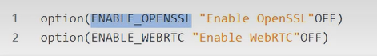
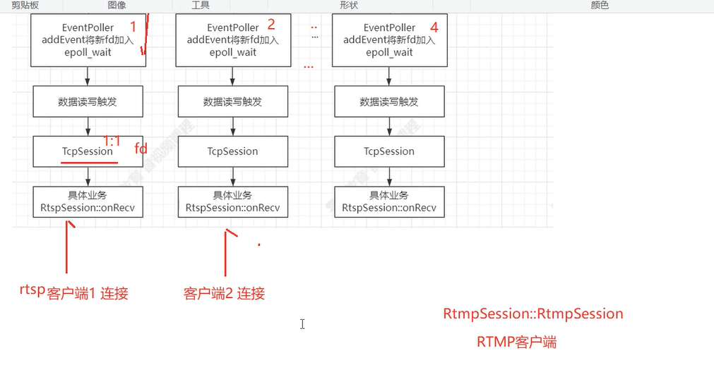
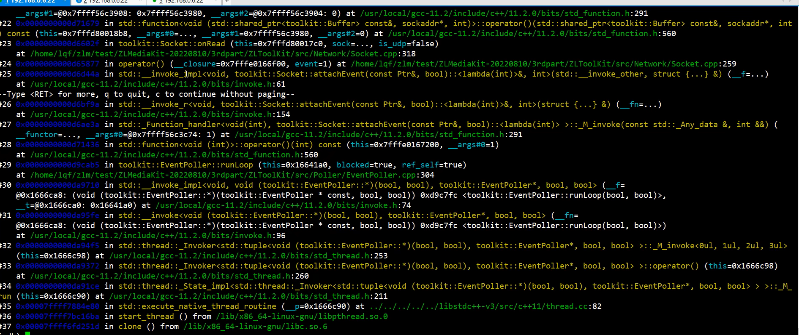

## 内容
1. zlmediakit编译
2. zlmediakit网络模型分析
3. zlmediakit RTSP 推拉流
4. 如何掌握zlmediakit的二次开发

## 音视频
1. 移动客户端的音视频
2. QT桌面音视频
3. 嵌入式音视频

## media-server
## ZLToolkit





```shell
lsof -i :80
```


### 抓包的技巧
1. 推流的包


2. 拉流的包
在拉流的客户端抓包


3. 网络模型
多线程 每一个线程绑定一个epoll




#### RTSP 推拉流

handleReq_Option


换行符


#### 拉流转发数据如何做


live/test
每一个epoll 都需要创建绑定一个RingReaderDispatcher




