### 时间戳
1. 显示时间戳 PTS(Presentation Time Stamp)
2. 解码时间戳
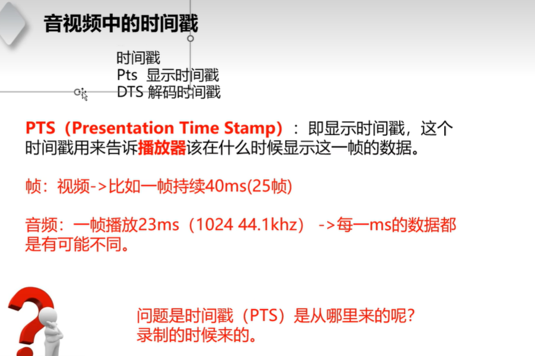
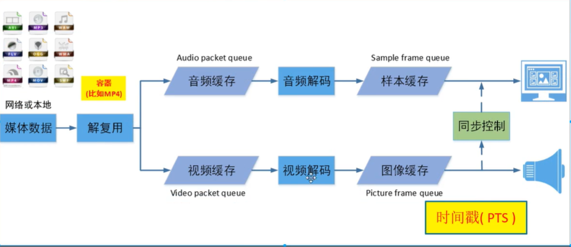
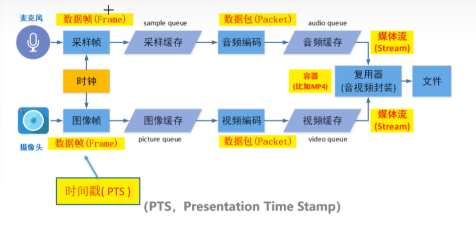
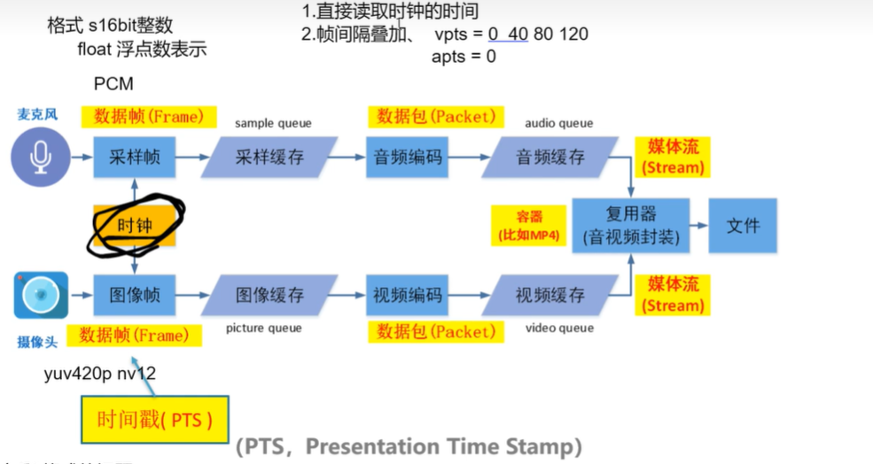

### 问题
1. 色彩不对 格式的问题
2. 锯齿 分片率 是内存对齐的问题 
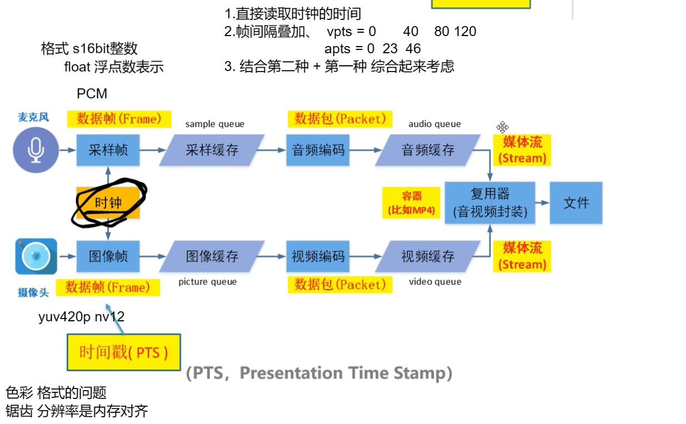

### 以音频为基准的
1. 当video 小于等于 音频的时间 那就可以渲染出来
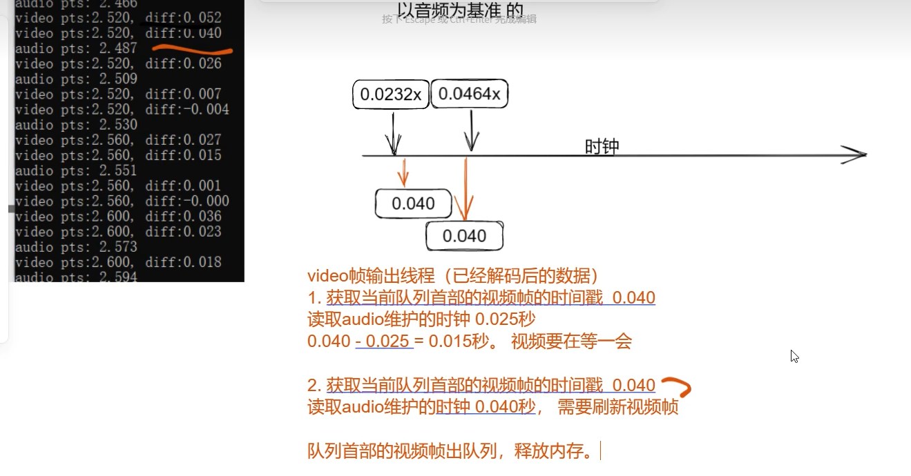

### 直播是否需要做音视频同步
#### 视频直播推流
1. 需要做视频同步: 网络抖动
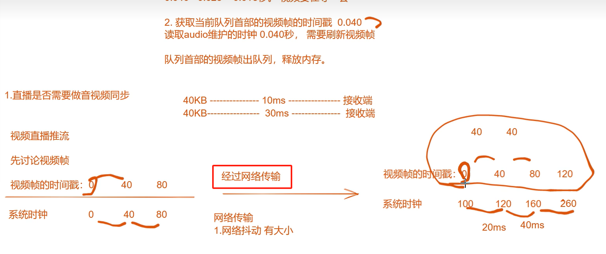
2. 网络带宽
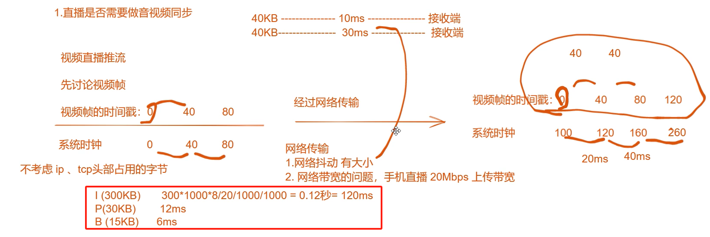

### 什么是音视频同步 
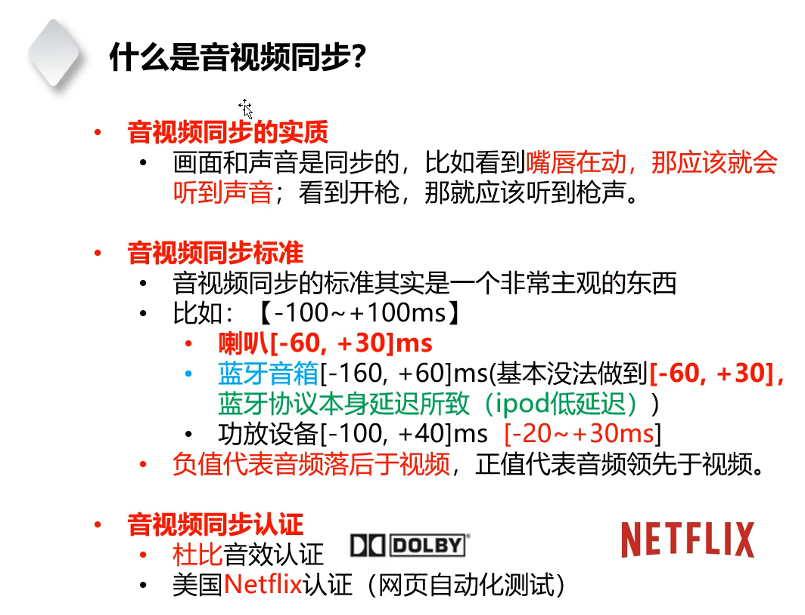

### 如何测试音视频是否同步
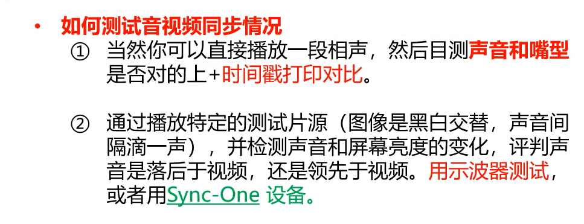
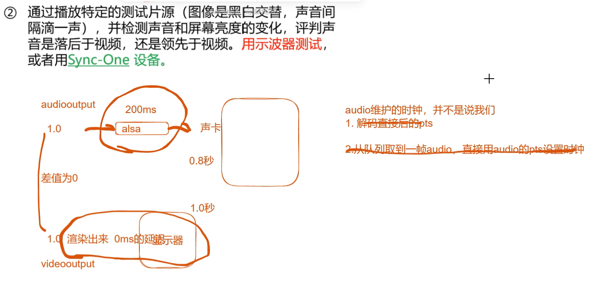

### 音视频同步原理
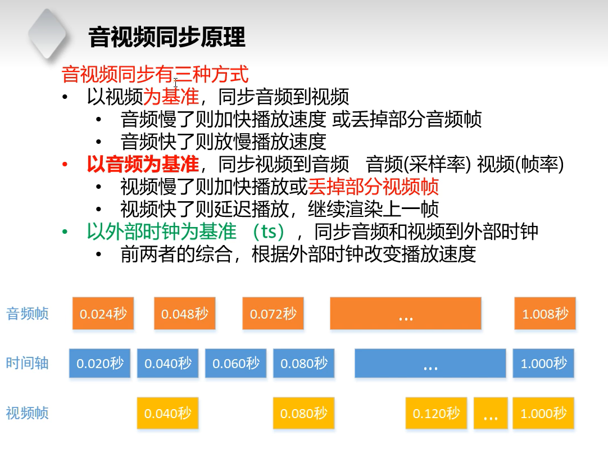

### 视频为基准
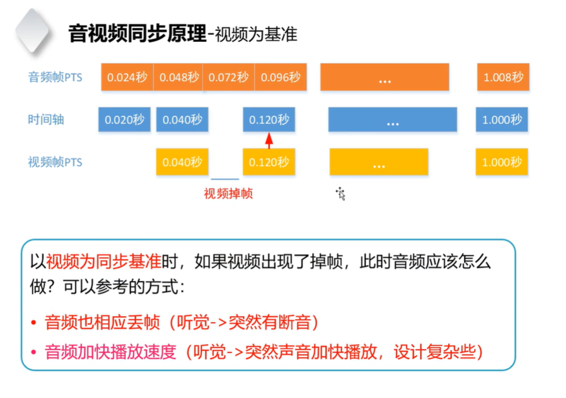

### 外部时钟为基准
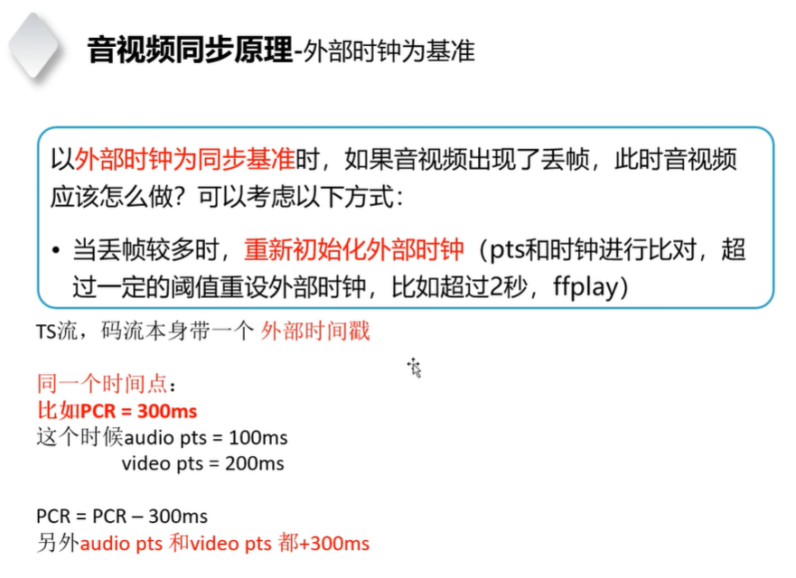

### 音视频时间换算的问题
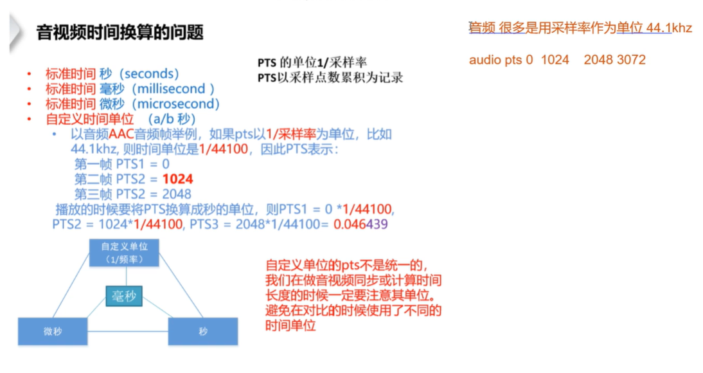