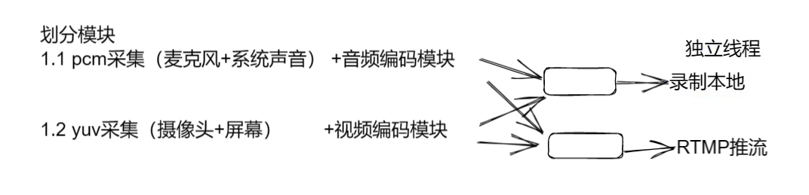

### ijkplayer

### 时间
{1,144440}

### 划分模块

### 视频编码(数据包packet)
1. 码率低  画质 延迟 CPU占用率

### 播放

1. flv 
2. mp4
3. ts

4. 如何识别是音频包 还是 视频包

5. 音视频 时间同步

### 识别音视频 
1. 识别是 flv mp4 rtsp rtmp ts 解复用器
2. avformat_open_input
3. av_find_best_stream
   获取音频 视频流编号
4. 读取音视频包

5. 

6. 快进快退

