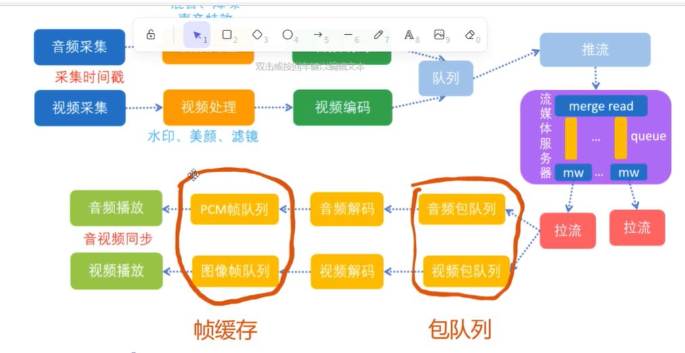
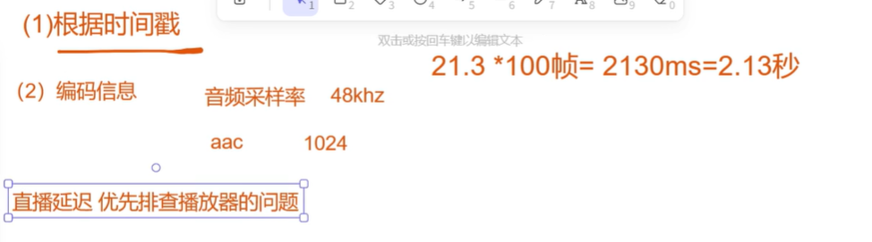
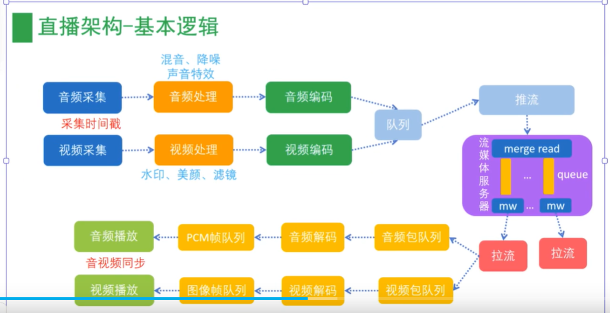
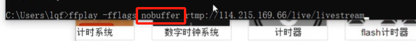
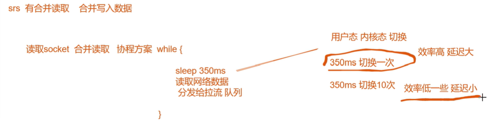

#### 直播延迟是什么原因导致的 如何分析 如何解决
#### 直播时 接收端 播放端是否需要做音视频同步

#### 直播延迟，播放器设计一定要注意缓存

1. 本地播放: 播放器包队列 帧队列大小要限制

2. 直播延迟 优先排查播放器的问题
3. 排查顺序: 拉流播放--->推流--->流媒体服务
4. 网络抖动
5. 带宽限制 视频帧传输的间隔更不稳定

#### 推流可能也有问题
1. 采集可能有延迟
2. 视频编码 可能也会导致延迟

#### SRS 合并读合并写
1. 推流 流媒体服务器处理 读取socket时 采用合并读取,采用的是协程的方案

2. 拉流 流媒体服务器处理

