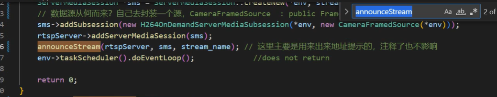
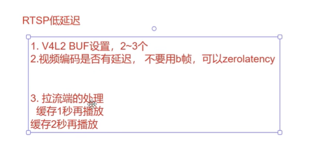

#### 方案摄像头方案选型
1. zlmediakit 

2. live555

#### 方案详解
1. mpi 或者usb
2. yuv mjpeg

#### v4l2
1. 打开摄像头
2. 检测摄像头是否有视频的能力
3. 检测摄像头支持的流式传输
4. 分辨率  哪些格式
5. 分辨率 格式

#### V4L2设置buffer

#### mjpeg yuv格式的优缺点
1. 带宽的问题

#### 编码优化
1. 画质 码率 CPU 延迟
2. I B B P 帧间隔*B帧数量

#### 如何将编码的H264流接入live555
1. 编译 live555
2. 参考现有的范例
3. 数据源接入

#### 代码实现

#### live555 ipc框架

设置到内核态

#### RTSP 低延迟
1. V4L2 BUF 设置 2-3个

#### filter libyuv mjpeg库 x264/openh264

#### rtsp和rtmp的区别
1. rtsp安防 rtp(udp) rtcp(udp)
2. rtsp 走的是554