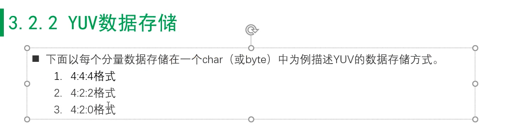

### 视频录制原理
1. 推流---->流媒体服务器转发--->拉流
### yuv rgb
1. h264---> yuv--->渲染
        YUV420P  

2. 码率太高 也会导致花屏
3. 分片率太高也导致 花屏

### 隔行 逐行

### 码率推荐表

### 跨距Stride
1. 硬件读取时有字节对齐的问题
2. YUV数据 AVFrame

### RGB 

### YUV

1. 海康威视 YUV播放器
2. YUV packed格式 和 YUV planar格式

3. YUV packed

4. YUV planar格式 YUV分开存

5. YUV 

6.  YUV 采用和存储是不一样的

### 绿屏 全绿

1. 全绿 是解码的问题 可能是分片率的问题

### 排查 (花屏 绿屏 黑屏)

1. 排查顺序 
排查接收端 发送端 服务器

### 接收端

1. 本地网络
2. 本地视频 用其他第三方播放器播放(VLC ffplay) 
 --> 保存解码前的数据 ---> ffplay 播放 h264
   dump h264的目的: 排查解封装的问题
   解码: 硬件解码: 是否报错 yuv格式 
   硬解: yuv420 
   软解: NV12
 dump yuv 数据有问题(内存对齐有问题)

3. 丢包时 也会出现 花屏

---
### 发送端排查顺序

1. dump h264
2. 为什么不先dump yuv ,就是担心dump yuv 后出现了问题

3. 弱网 udp发送有没有可能丢包；弱网队列堆积了数据，出现了drop数据的情况
4. 黑屏 有可能是渲染的时候出现问题
5. 绿屏 解码丢数据
6. 花屏 丢数据的问题，码率过低
---
### 服务器

